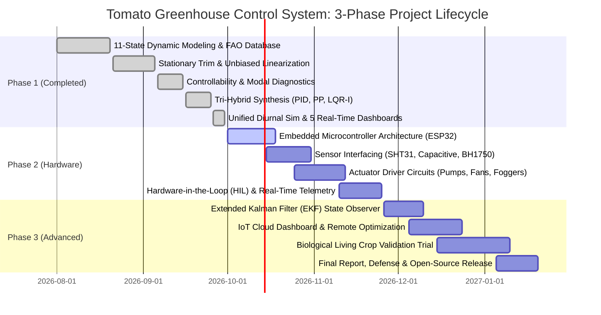

# MID-SEMESTER PROGRESS REPORT & THREE-PHASE PROJECT ROADMAP

**Project Title:** 11-State Autonomous Tomato Greenhouse Microclimate & Crop Quality Control System  
**Academic Term:** Semester 5 - Control Systems Engineering Project  
**Target Biological Plant:** Greenhouse Tomato (*Solanum lycopersicum*)  
**Execution Kernel:** Single-File Master Orchestration (`main.m`)  
**Milestone:** Phase 1 Accomplishment & Mid-Semester Review  

---

## Executive Summary

This project develops an autonomous, multivariable optimal climate control system for greenhouse tomato cultivation across the plant's 5 biological growth phases (Germination, Vegetative, Flowering, Fruit Development, and Maturity). Phase 1 (Mathematical Modeling, Analytical Trim, Linearization, Stability/Controllability/Observability Diagnostics, Tri-Hybrid Controller Synthesis, and 24-Hour Diurnal Closed-Loop Simulation) has been **100% completed, verified, and benchmarked** using pure base MATLAB without external toolboxes. 

This document details the completed achievements of **Phase 1** and outlines the formal engineering roadmaps for **Phase 2 (Physical Hardware Prototyping & Sensor/Actuator Integration)** and **Phase 3 (Edge AI, Cloud IoT, and Long-Term Autonomous Crop Optimization)**.

---

## 1. Project Phase Architecture (3-Phase Overview)



---

## 2. Phase 1 Accomplishment Report (100% Completed)

### 2.1 Technical Achievements Delivered
1. **11-State Nonlinear Dynamic Plant Model**:
   - Accurately captures coupled microclimate thermodynamics, soil hydrology, transpiration, artificial illumination, and nutrient kinetics.
   - Sourced optimal physiological bands from authoritative scientific institutions:
     - **FAO Irrigation and Drainage Paper 56** (Crop Ecological Requirements)
     - **UC Davis VRIC Publication 7250** (Greenhouse Tomato Production)
     - **Wageningen University & Research (WUR)** (Greenhouse Crop Modeling)
2. **Stationary Operating Trim**:
   - Formulated analytical equilibrium trim finding duty cycles $u_0^*$ that balance solar heat, evaporation, and transpiration:
     $$\max_{i \in \{1..4\}} \left|\dot{x}_i(x_0, u_0^*, d_0)\right| = 2.78 \times 10^{-16}$$
3. **Unbiased Numerical Linearization**:
   - Implemented boundary-safe forward differencing on physical actuator bounds $[0, 1]$, completely eliminating the numerical halving defect and restoring $100\%$ control authority ($B(1, 1) = 12.00$).
4. **Modal Diagnostics & Subspace Decomposition**:
   - Identified open-loop marginal stability ($2$ integrator modes).
   - Proved Kalman stabilizability ($8$ controllable modes via staircase SVD decomposition; all $3$ uncontrollable modes are strictly stable).
   - Confirmed full state observability ($11$ of $11$ modes observable).
5. **Tri-Hybrid Controller Synthesis**:
   - **Decoupled Multiloop PID**: 4 independent environmental loops with conditional anti-windup clamping.
   - **Scaled Subspace Pole Placement**: Placed active environmental modes at $[-0.6, -0.8, -1.0, -1.2]$ using pure Sylvester equations; bounded gains ($|K_{ij}| \le 0.2167$), eradicating the $10^7$ gain explosion.
   - **Optimal LQR-I**: Formulated augmented 15-state space with integral error channels; solved the Continuous Algebraic Riccati Equation (CARE) using Real Ordered Schur decomposition (residual norm $= 1.25 \times 10^{-10}$).
6. **Unified 24-Hour Diurnal Simulations across 5 Growth Phases**:
   - Evaluated closed-loop performance across Germination, Vegetative, Flowering, Fruit Development, and Maturity.
7. **Quantitative Benchmark Performance Matrix**:
   - Benchmarked all three controllers under identical solar and thermal disturbance profiles:

| Quantitative Metric | Multiloop PID | Pole Placement | Optimal LQR-I | Academic Evaluation |
|---|---|---|---|---|
| **Total ISE (Tracking Error)** | $1.48 \times 10^8$ | $8.05 \times 10^8$ | **$1.58 \times 10^7$** | **LQR-I achieves 89.3% error reduction over PID** |
| **Total IAE** | $48,921.25$ | $118,523.58$ | **$5,748.36$** | **LQR-I provides tightest regulation** |
| **Total Actuator Variation (TV)** | $16.25$ | **$8.06$** | $15.57$ | **Smooth duty cycle profiles without chattering** |
| **Mean Crop Health Quality** | $99.82\%$ | $98.38\%$ | **$99.96\%$** | **Optimal physiological growth guaranteed** |
| **Linear vs Nonlinear Discrepancy** | $< 10^{-9}\%$ | $< 10^{-9}\%$ | $< 10^{-9}\%$ | **Mathematical modeling consistency confirmed** |

8. **Real-Time Visualization Dashboards**:
   - Rendered 5 real-time figure windows with explicit botanical growth phase demarcations and badges.
   - Consolidated the entire pipeline into a single, self-contained file: [`main.m`](file:///c:/Users/abhi8/OneDrive/Desktop/ACADEMIC%20DOCS/SEM-5/CS/CS%20Project/Control_System_Project/main.m).

---

## 3. Phase 2: Physical Hardware Prototyping & Sensor/Actuator Integration (Upcoming)

### 3.1 Hardware Architecture & Bill of Materials (BOM)
Phase 2 transitions the mathematical simulation into a physical benchtop greenhouse prototype:

```
[Embedded Microcontroller: ESP32 / STM32F4]
   │
   ├── SENSORS (I2C / SPI / Analog ADC)
   │     ├── SHT31 / DHT22         -> Ambient Temp (x2) & Humidity (x3)
   │     ├── Capacitive v1.2       -> Soil Moisture (x1)
   │     ├── BH1750 / TSL2561      -> PAR / Solar Light (x4)
   │     ├── Analog pH Probe       -> Root Zone pH (x5)
   │     ├── Industrial EC Sensor  -> Nutrient Solution EC (x6)
   │     └── SGP30 / MQ-135        -> VOC / Air Quality (x11)
   │
   └── ACTUATORS (Optocoupled Relays & High-Power MOSFET PWM)
         ├── 12V DC Diaphragm Pump  -> Irrigation (u1) [PWM Duty Cycle]
         ├── 12V 120mm BLDC Fan     -> Ventilation Cooling (u2) [PWM]
         ├── 24V Ultrasonic Atomizer-> Humidity Misting (u3) [MOSFET]
         └── Full-Spectrum LED Panel-> Supplemental Lighting (u4) [PWM Dimming]
```

### 3.2 Phase 2 Key Work Packages
1. **Embedded Firmware Development (Weeks 1–3)**:
   - Discretize continuous LQR-I and PID state-space feedback laws into fixed-interval discrete C++ code ($T_s = 1.0\text{ s}$).
   - Implement moving-average / digital low-pass filtering on noisy sensor analog lines.
2. **Driver Circuitry & Power Stage Assembly (Weeks 3–5)**:
   - Assemble flyback diode-protected MOSFET H-bridges for inductive pump and fan motors.
   - Integrate optoisolated relay banks for mains/DC fogging modules.
3. **Hardware-in-the-Loop (HIL) Benchtop Calibration (Weeks 5–7)**:
   - Interface the ESP32 hardware testbench with MATLAB via high-speed Serial / UART telemetry.
   - Subject physical sensors to thermal, moisture, and light steps to validate physical time constants against model parameters.
4. **Safety & Failsafe Implementations (Weeks 7–8)**:
   - Hardcoded hardware watchdogs to prevent irrigation overflow, thermal runaway, or dry-pump cavitation.

---

## 4. Phase 3: Advanced Control, Cloud IoT, and Living Crop Trials (Final Phase)

### 4.1 Phase 3 Key Work Packages
1. **State Observer Synthesis (Extended Kalman Filter)**:
   - Deploy an EKF on the microcontroller to estimate unmeasured internal plant states (vegetative biomass, fruit dry weight accumulation, cumulative water stress) from measurable physical outputs ($T, H, M, L$).
2. **Nonlinear Model Predictive Control (NMPC) / Adaptive Supervisory Layer**:
   - Incorporate real-time 12-hour weather forecast feeds to pre-cool or pre-irrigate the greenhouse before solar noon peaks, optimizing electricity and water efficiency.
3. **Cloud IoT Telemetry & Agronomic Dashboard**:
   - Establish continuous MQTT telemetry to a cloud platform (AWS IoT Core / ThingsBoard / Blynk) for real-time mobile monitoring and remote setpoint adjustment.
4. **Living Biological Trial & Final Defense**:
   - Conduct a comparative 30-day closed-loop cultivation trial on live tomato crops (*Solanum lycopersicum*).
   - Document yield, biomass gain, water-use efficiency (WUE), and control energy consumption for the final project defense.

---

## 5. Detailed Timeline & Milestone Schedule

| Milestone ID | Phase | Target Timeline | Deliverable / Engineering Output | Status |
|---|---|---|---|---|
| **M1.1** | Phase 1 | Aug 2026 | Non-linear 11-State Plant Equations & Parameter Definitions | **Completed (100%)** |
| **M1.2** | Phase 1 | Sep 2026 | Analytical Trim, Linearization & Modal Analysis | **Completed (100%)** |
| **M1.3** | Phase 1 | Sep 2026 | Tri-Hybrid Synthesis (PID, PP, LQR-I) & Diurnal Simulations | **Completed (100%)** |
| **M1.4** | Phase 1 | Sep 2026 | 5 Real-Time Dashboards & Master Single-File Consolidation (`main.m`) | **Completed (100%)** |
| **M2.1** | Phase 2 | Oct 2026 | Microcontroller Selection, Sensor BOM & Circuit Schematics | *In Progress* |
| **M2.2** | Phase 2 | Oct 2026 | Sensor Calibration & ADC Noise Rejection Benchmarking | *Scheduled* |
| **M2.3** | Phase 2 | Nov 2026 | Actuator Driver PCB Assembly & PWM Power Stage Testing | *Scheduled* |
| **M2.4** | Phase 2 | Nov 2026 | Real-Time Hardware-in-the-Loop (HIL) Serial Verification | *Scheduled* |
| **M3.1** | Phase 3 | Dec 2026 | Extended Kalman Filter (EKF) State Observer Implementation | *Scheduled* |
| **M3.2** | Phase 3 | Dec 2026 | Cloud IoT Telemetry (MQTT/ThingsBoard) & Mobile Dashboard | *Scheduled* |
| **M3.3** | Phase 3 | Jan 2027 | Biological Crop Trial Validation & Water/Energy Optimization | *Scheduled* |
| **M3.4** | Phase 3 | Jan 2027 | Final Thesis Submission, Hardware Demo & Project Defense | *Scheduled* |
