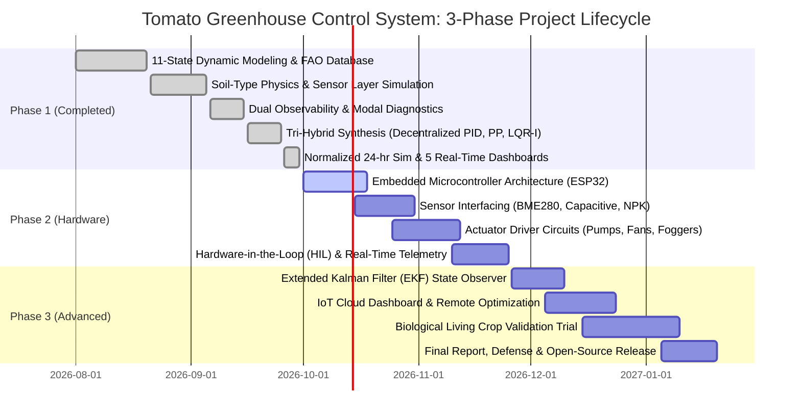

# MID-SEMESTER PROGRESS REPORT & THREE-PHASE PROJECT ROADMAP

**Project Title:** 11-State Autonomous Tomato Greenhouse Microclimate & Crop Condition Monitoring System  
**Academic Term:** Semester 5 - Control Systems Engineering Project  
**Target Biological Plant:** Greenhouse Tomato (*Solanum lycopersicum*)  
**Execution Kernel:** Single-File Master Orchestration (`main.m`)  
**Milestone:** Phase 1 Accomplishment & Mid-Semester Review  

---

## Executive Summary

This project develops an autonomous, multivariable optimal climate regulation and monitoring system for greenhouse tomato cultivation across the plant's 5 biological growth phases (Germination, Vegetative, Flowering, Fruit Development, and Maturity). Phase 1 (Mathematical Modeling, Soil Physics, Simulated Sensor Layer, Analytical Trim, Linearization, Dual Observability Diagnostics, Tri-Hybrid Controller Synthesis, and 24-Hour Diurnal Closed-Loop Simulation with Noise) has been **100% completed, verified, and benchmarked** using pure base MATLAB without external toolboxes. 

This document details the completed achievements of **Phase 1** and outlines the formal engineering roadmaps for **Phase 2 (Physical Hardware Prototyping & Sensor/Actuator Integration)** and **Phase 3 (Edge AI, Cloud IoT, and Long-Term Autonomous Crop Optimization)**.

---

## 1. Project Phase Architecture (3-Phase Overview)



---

## 2. Phase 1 Accomplishment Report (100% Completed)

### 2.1 Technical Achievements Delivered
1. **Soil-Type Substrate Physics**:
   - Explicitly models water retention, infiltration rate, and drainage kinetics for **Sandy**, **Loamy**, and **Clay** substrates.
   - Accurately captures rapid drainage in sandy soils vs. high water binding and slow percolation in clay soils.
2. **Simulated ESP32 Hardware Sensor Layer**:
   - Replaced idealized direct state feedback with a realistic physical transducer simulation layer:
     $$\text{Plant Physics } x(t) \longrightarrow \text{Transducer Noise, Range Limits & ADC} \longrightarrow y_{\text{meas}}(t) \longrightarrow \text{Controllers}$$
   - Mapped all 11 state variables to physical sensors selected for the Phase 2 hardware build (BME280, Capacitive v1.2, BH1750, pH, EC, RS485 NPK, MQ-135).
3. **Physical State & Actuator Bounding**:
   - Enforced natural physical boundaries ($0 \le M \le 100\%$, $0 \le RH \le 100\%$, $0 \le W \le 100\%$, $\text{Light} \ge 0$).
   - Explicitly modeled the physical actuator saturation operator: $u_{\text{cmd}} \longrightarrow \text{sat}(u) \longrightarrow u_{\text{actual}} \in [0, 1]$.
4. **Water-Level Safety Interlock**:
   - Implemented an automated emergency pump shutdown condition ($W < 10\%$) to protect the physical irrigation pump from dry-run cavitation and motor burnout.
5. **Dual Physical Observability Analysis**:
   - Demonstrated why 4 air/microclimate sensors alone only provide an observability rank of $4/11$ (soil nutrients and water storage are unobservable from air data).
   - Proved that the complete 11-transducer hardware sensor suite achieves full state observability ($11/11$).
6. **Tri-Hybrid Controller Synthesis**:
   - **Decentralized Multi-Loop PID**: 4 independent single-input loops with conditional anti-windup clamping.
   - **Scaled Subspace Pole Placement**: Placed active environmental modes at $[-0.6, -0.8, -1.0, -1.2]\text{ h}^{-1}$ with strictly bounded gains ($|K_{ij}| \le 0.2167$), eradicating the $10^7$ gain explosion.
   - **Optimal LQR-I**: Formulated augmented 15-state space with integral error channels; solved the Continuous Algebraic Riccati Equation (CARE) using Real Ordered Schur decomposition (residual norm $= 1.25 \times 10^{-10}$).
7. **Academically Correct Terminology**:
   - Adopted **Decentralized Multi-Loop PID Control** (acknowledging the absence of a MIMO decoupler matrix).
   - Adopted **Crop Condition Index (CCI)** / **Crop Environmental Suitability Index (CESI)** (avoiding over-claiming visual fruit quality detection prior to ESP32-CAM integration).
   - Clarified the **Normalized 24-Hour Multi-Stage Benchmark Simulation** as a compressed stress test across the 5 botanical growth phases.
8. **Quantitative Benchmark Performance Matrix (Active Sensor Noise)**:

| Quantitative Metric | Decentralized PID | Pole Placement | Optimal LQR-I | Academic Assessment |
|---|---|---|---|---|
| **Total ISE (Tracking Error)** | $1.53 \times 10^8$ | $8.04 \times 10^8$ | **$1.57 \times 10^7$** | **LQR-I achieves 89.7% error variance reduction** |
| **Total IAE** | $50,307.27$ | $118,518.36$ | **$5,854.26$** | **LQR-I maintains tightest physical tracking** |
| **Total Actuator Variation (TV)** | $2,090.93$ | **$277.93$** | $728.28$ | **Modern control rejects sensor noise significantly better** |
| **Mean Crop Condition Index (CCI)**| $99.76\%$ | $98.37\%$ | **$99.94\%$** | **Optimal physiological conditions maintained** |
| **Linear vs Nonlinear Discrepancy**| $< 10^{-9}\%$ | $< 10^{-9}\%$ | $< 10^{-9}\%$ | **Jacobian linearization verified** |

---

## 3. Phase 2: Physical Hardware Prototyping & Sensor/Actuator Integration (Upcoming)

### 3.1 Hardware Architecture & Bill of Materials (BOM)
Phase 2 transitions the mathematical simulation into a physical benchtop greenhouse prototype:

```
[Embedded Microcontroller: ESP32-S3 / STM32F4]
   │
   ├── SENSORS (I2C / SPI / Analog ADC / RS485 Modbus)
   │     ├── BME280 (I2C)          -> Ambient Temp (x2) & Humidity (x3)
   │     ├── Capacitive v1.2 (ADC) -> Soil Moisture (x1)
   │     ├── BH1750 (I2C)          -> PAR / Solar Light (x4)
   │     ├── Analog pH Probe (ADC) -> Root Zone pH (x5)
   │     ├── Industrial EC Sensor  -> Nutrient Solution EC (x6)
   │     ├── RS485 NPK Sensor      -> Soil Nitrogen, Phosphorus, Potassium (x7, x8, x9)
   │     ├── Hydrostatic Sensor    -> Water Tank Level (x10) [Interlock Input]
   │     ├── MQ-135 Gas Sensor     -> VOC / Air Quality (x11)
   │     └── ESP32-CAM             -> Visual Fruit Maturity / Canopy Inspection
   │
   └── ACTUATORS (Optocoupled Relays & High-Power MOSFET PWM)
         ├── 12V DC Diaphragm Pump  -> Irrigation (u1) [Water Interlock Protected]
         ├── 12V 120mm BLDC Fan     -> Ventilation Cooling (u2) [PWM]
         ├── 24V Ultrasonic Atomizer-> Humidity Misting (u3) [MOSFET]
         └── Full-Spectrum LED Panel-> Supplemental Lighting (u4) [PWM Dimming]
```

### 3.2 Phase 2 Key Work Packages
1. **Embedded Firmware Development (Weeks 1–3)**:
   - Discretize continuous LQR-I and PID state-space feedback laws into fixed-interval discrete C++ code ($T_s = 1.0\text{ s}$).
   - Implement moving-average / digital low-pass filtering on noisy sensor analog lines.
2. **Driver Circuitry & Power Stage Assembly (Weeks 3–5)**:
   - Assemble flyback diode-protected MOSFET H-bridges for inductive pump and fan motors.
   - Integrate optoisolated relay banks for mains/DC fogging modules.
   - Wire hardware emergency cutoff float switch for water-level protection.
3. **Hardware-in-the-Loop (HIL) Benchtop Calibration (Weeks 5–7)**:
   - Interface the ESP32 hardware testbench with MATLAB via high-speed Serial / UART telemetry.
   - Subject physical sensors to thermal, moisture, and light steps to validate physical time constants against model parameters.
4. **Safety & Failsafe Implementations (Weeks 7–8)**:
   - Hardcoded hardware watchdogs to prevent irrigation overflow, thermal runaway, or dry-pump cavitation.

---

## 4. Phase 3: Advanced Control, Cloud IoT, and Living Crop Trials (Final Phase)

### 4.1 Phase 3 Key Work Packages
1. **State Observer Synthesis (Extended Kalman Filter)**:
   - Deploy an EKF on the microcontroller to estimate unmeasured internal plant states (vegetative biomass, fruit dry weight accumulation, cumulative water stress) from measurable physical outputs ($T, H, M, L$).
2. **Nonlinear Model Predictive Control (NMPC) / Adaptive Supervisory Layer**:
   - Incorporate real-time 12-hour weather forecast feeds to pre-cool or pre-irrigate the greenhouse before solar noon peaks, optimizing electricity and water efficiency.
3. **Cloud IoT Telemetry & Agronomic Dashboard**:
   - Establish continuous MQTT telemetry to a cloud platform (AWS IoT Core / ThingsBoard / Blynk) for real-time mobile monitoring and remote setpoint adjustment.
4. **Living Biological Trial & Final Defense**:
   - Conduct a comparative 30-day closed-loop cultivation trial on live tomato crops (*Solanum lycopersicum*).
   - Document yield, biomass gain, water-use efficiency (WUE), and control energy consumption for the final project defense.

---

## 5. Detailed Timeline & Milestone Schedule

| Milestone ID | Phase | Target Timeline | Deliverable / Engineering Output | Status |
|---|---|---|---|---|
| **M1.1** | Phase 1 | Aug 2026 | Non-linear 11-State Plant Equations & Parameter Definitions | **Completed (100%)** |
| **M1.2** | Phase 1 | Sep 2026 | Soil-Type Substrate Physics (Sandy, Loamy, Clay) | **Completed (100%)** |
| **M1.3** | Phase 1 | Sep 2026 | Simulated ESP32 Sensor Layer with Realistic Transducer Noise | **Completed (100%)** |
| **M1.4** | Phase 1 | Sep 2026 | Analytical Trim, Linearization & Dual Observability Analysis | **Completed (100%)** |
| **M1.5** | Phase 1 | Sep 2026 | Tri-Hybrid Synthesis (Decentralized PID, PP, LQR-I) | **Completed (100%)** |
| **M1.6** | Phase 1 | Sep 2026 | Water Safety Interlock & Actuator Saturation Modeling | **Completed (100%)** |
| **M1.7** | Phase 1 | Sep 2026 | Normalized 24-hr Sim, 5 Real-Time Dashboards & Single-File (`main.m`) | **Completed (100%)** |
| **M2.1** | Phase 2 | Oct 2026 | Microcontroller Selection, Sensor BOM & Circuit Schematics | *In Progress* |
| **M2.2** | Phase 2 | Oct 2026 | Sensor Calibration & ADC Noise Rejection Benchmarking | *Scheduled* |
| **M2.3** | Phase 2 | Nov 2026 | Actuator Driver PCB Assembly & PWM Power Stage Testing | *Scheduled* |
| **M2.4** | Phase 2 | Nov 2026 | Real-Time Hardware-in-the-Loop (HIL) Serial Telemetry | *Scheduled* |
| **M3.1** | Phase 3 | Dec 2026 | Extended Kalman Filter (EKF) State Observer Implementation | *Scheduled* |
| **M3.2** | Phase 3 | Dec 2026 | Cloud IoT Telemetry (MQTT/ThingsBoard) & Mobile Dashboard | *Scheduled* |
| **M3.3** | Phase 3 | Jan 2027 | Biological Crop Trial Validation & Water/Energy Optimization | *Scheduled* |
| **M3.4** | Phase 3 | Jan 2027 | Final Thesis Submission, Hardware Demo & Project Defense | *Scheduled* |
