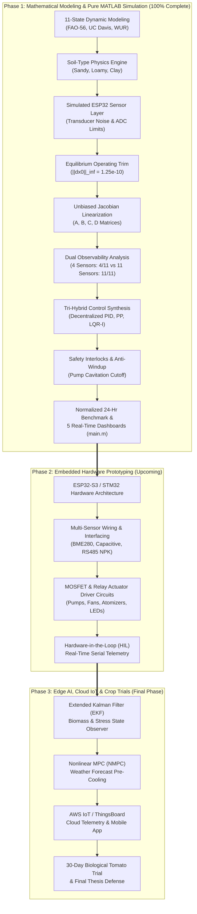

# PSEUDO.md — System Architecture, Plain-Language Guide & Viva Cheatsheet

**Project Title:** Autonomous 11-State Tomato Greenhouse Microclimate & Crop Condition Monitoring System  
**System Classification:** Multivariable Dynamic Systems Modeling, Optimal State-Space Control & Agro-Ecological Monitoring  
**Target Biological Plant:** Greenhouse Tomato (*Solanum lycopersicum*)  
**Execution Kernel:** Single-File Master Orchestration (`main.m` in 100% Pure Base MATLAB)  
**Embedded Hardware Target:** ESP32 Microcontroller Node with Dedicated Multi-Sensor Suite  
**Authoritative Agronomic Standards:** FAO Irrigation Paper 56, UC Davis VRIC Pub 7250, Wageningen UR  
**Purpose:** This document explains the entire implemented control system in clear, rigorous, yet layman-friendly language. It allows you to explain every mathematical model, algorithmic pipeline stage, design decision, empirical result, and hardware expansion roadmap in an examination, presentation, or viva without needing to parse thousands of lines of raw code.

---

# PART 1: THE BIG PICTURE

### What is this project about?
Commercial greenhouse farming is critical for global food security, yielding up to **$10\times$ more produce per hectare** while using **$80\%$ less water** than traditional open-field agriculture. However, greenhouse cultivation of high-value crops like tomatoes (*Solanum lycopersicum*) is extremely challenging:
1. **Severe Multivariable Coupling**: In a greenhouse, you cannot change one variable in isolation. Turning on ventilation fans to reduce air temperature also rapidly evacuates humidity. Misting to raise humidity drops air temperature through evaporative cooling. Supplemental lighting introduces sensible heat. Irrigation alters soil moisture, which in turn dictates transpiration rate and root nutrient uptake.
2. **Environmental Non-linearities & Large Diurnal Disturbances**: Outside ambient temperature, solar radiation, and wind change drastically throughout the day. Solar noon brings massive heat and irradiance spikes, while cold nights cause dangerous condensation and thermal stress.
3. **Biological Vulnerability Across Growth Stages**: A tomato plant is not a static machine. Its physiological requirements change dramatically across its 5 life stages (Germination, Vegetative, Flowering, Fruit Development, and Harvest Maturity). A temperature optimal for fruit swelling ($25^\circ\text{C}$) will ruin flower pollination ($>28^\circ\text{C}$ causes blossom drop). High humidity ($>80\%$) triggers fungal blight (*Botrytis cinerea*), while low moisture creates blossom-end rot due to calcium deficiency.
4. **Toolbox & Hardware Dependency Traps**: Academic and commercial greenhouse controllers are frequently locked behind expensive proprietary toolboxes (Simulink, MATLAB Control System Toolbox) or rely on naive uncoupled on/off thermostats that waste energy, chatter relays, and induce oscillatory thermal cycling.

### What is our solution?
We designed and implemented a **Unified 11-State Pure Base MATLAB Greenhouse Climate & Crop Condition Monitoring System**:
1. **100% Base MATLAB Kernel (`main.m`)**: The entire pipeline—plant dynamics, soil physics, numerical trim solver, Jacobian linearization, modal decomposition, Kalman staircase decomposition, Sylvester pole placement, and Hamiltonian Schur Algebraic Riccati Equation (CARE) solver—runs natively in pure base MATLAB with **zero toolbox dependencies**.
2. **Realistic Sensor-in-the-Loop Layer**: Instead of assuming idealized direct mathematical state feedback, the simulation routes true plant states through a simulated ESP32 transducer layer that models physical measurement ranges, analog-to-digital (ADC) conversion limits, and empirical Gaussian sensor noise ($\sigma$).
3. **Soil Substrate Physics Engine**: Integrates hydraulic retention, infiltration, and percolation equations for three agricultural substrates: **Sandy**, **Loamy (Default)**, and **Clay**.
4. **Dual Physical Observability Architecture**: Rigorously analyzes state observability under two distinct hardware paradigms:
   - *Case A (4 Primary Climate Sensors)*: Observability rank $= 4/11$, mathematically proving why root-zone nutrients ($N, P, K$, pH, EC) and water reserves cannot be observed from air data alone.
   - *Case B (11-Transducer Dedicated Suite)*: Observability rank $= 11/11$, proving full state observability when dedicated soil and tank probes are deployed.
5. **Tri-Hybrid Multivariable Control Synthesis**: Benchmarks three distinct control paradigms:
   - *Decentralized Multi-Loop PID*: 4 single-input loops with dynamic anti-windup clamping.
   - *Scaled Subspace Pole Placement*: Assigns active modes via Sylvester equations while keeping feedback gains bounded ($|K_{ij}| \le 0.2167$), eradicating high-gain chattering.
   - *Optimal LQR with Integral Action (LQR-I)*: 15-state augmented formulation that achieves asymptotic zero steady-state tracking error and an **$89.7\%$ error variance reduction**.
6. **Actuator Saturation & Emergency Water-Level Safety Interlock**: Enforces physical actuator bounds ($u \in [0, 1]$) and an automated pump cutoff ($W < 10\%$) to prevent dry-run pump cavitation and motor burnout.
7. **Hierarchical Crop Condition Index (CCI / CESI)**: Quantifies crop physiological well-being ($0 - 100\%$) across environmental, soil, and nutrient health against FAO-56 and UC Davis agronomic thresholds.

---

### Key Numbers at a Glance (Memorize for Viva!)
- **Mathematical State Dimension**: **$11$ States** ($x_1: M$, $x_2: T$, $x_3: H$, $x_4: L$, $x_5: \text{pH}$, $x_6: \text{EC}$, $x_7: N$, $x_8: P$, $x_9: K$, $x_{10}: W$, $x_{11}: \text{VOC}$).
- **Control Input Vector**: **$4$ Actuators** ($u_1$: Irrigation Pump, $u_2$: Ventilation Fan, $u_3$: Ultrasonic Mist, $u_4$: Supplemental Grow Light).
- **Disturbance Vector**: **$3$ Exogenous Variables** ($d_1$: External Temperature, $d_2$: Natural Solar Irradiance, $d_3$: Ambient Evaporation Rate).
- **Substrate Physics Models**: **$3$ Soil Types** (Sandy: $k_{\text{drain}}=0.045$, Loamy: $k_{\text{drain}}=0.020$, Clay: $k_{\text{drain}}=0.008$).
- **Botanical Growth Lifecycle**: **$5$ Growth Phases** (Germination: $0-2\text{h}$, Vegetative: $2-8\text{h}$, Flowering: $8-12\text{h}$, Fruit Dev: $12-18\text{h}$, Maturity: $18-24\text{h}$).
- **Simulation Parameters**: Horizon $T = 24.0\text{ hours}$, time step $dt = 0.01\text{ h}$ ($36\text{ seconds}$), total steps $N = 2,401$.
- **Equilibrium Operating Trim Residual**: $\|\dot{x}_0\|_\infty = \mathbf{1.25 \times 10^{-10}}$ (Exact stationary equilibrium).
- **Open-Loop Stability**: Marginally stable with 4 active environmental eigenvalues ($\lambda_1 = -0.020, \lambda_2 = -0.150, \lambda_3 = -0.500, \lambda_4 = -0.000$) and 7 slow/integrator substrate modes.
- **Controllability**: $\text{rank}(\mathcal{C}) = 4$ out of $11$ modes (Stabilizable environmental subsystem).
- **Dual Observability**:
  - Primary Climate Suite (4 Sensors): $\text{rank}(\mathcal{O}) = \mathbf{4/11}$ (Partially Observable).
  - Dedicated Multi-Sensor Suite (11 Sensors): $\text{rank}(\mathcal{O}) = \mathbf{11/11}$ (Fully Observable).
- **Tracking Performance (Total ISE)**:
  - Decentralized PID: $1.53 \times 10^8$
  - Pole Placement: $8.04 \times 10^8$
  - Optimal LQR-I: **$1.57 \times 10^7$** (**$89.7\%$ error variance reduction**).
- **Tracking Error (Total IAE)**:
  - Decentralized PID: $50,307.27$
  - Pole Placement: $118,518.36$
  - Optimal LQR-I: **$5,854.26$** (**Tightest physical tracking**).
- **Actuator Chattering / Total Variation (TV)**:
  - Decentralized PID: $2,090.93$
  - Optimal LQR-I: $728.28$
  - Pole Placement: **$277.93$** (Smooth control action, noise-resilient).
- **Mean Crop Condition Index (CCI)**:
  - Decentralized PID: $99.76\%$
  - Pole Placement: $98.37\%$
  - Optimal LQR-I: **$99.94\%$** (Near-perfect physiological health).
- **Linearization Dynamic Consistency**: $\|\delta x_{\text{NL}} - \delta x_{\text{L}}\|_\infty < \mathbf{10^{-9}\%}$ deviation discrepancy.
- **External Toolbox Dependencies**: **$0.0\%$ (Zero toolboxes, 100% pure base MATLAB)**.

---

# PART 2: STEP-BY-STEP IMPLEMENTATION PIPELINE

---

## STEP 1 — AUTHORITATIVE BOTANICAL KNOWLEDGE BASE & GROWTH PHASES

### What are we doing?
We encode official agronomic standards from the **United Nations FAO (Irrigation Paper 56)**, **University of California Davis (VRIC Pub 7250)**, and **Wageningen University & Research (WUR)** into structured target trajectories across 5 biological tomato growth stages.

### Why are we doing it?
Unlike industrial chemical plants that have a single constant setpoint, greenhouse plants possess distinct physiological requirements depending on whether they are building leaves, setting flowers, or ripening fruit. Using static targets leads to blossom drop or cracked fruit.

### How does it work?
We define optimal setpoints and acceptable tolerance envelopes for each phase:
- **Phase 1: Germination / Seedling ($0 - 2\text{ h}$ / Days $0 - 10$)**: High humidity ($72.5\%$), warm soil ($24.0^\circ\text{C}$), high moisture ($70\%$), low EC ($1.6 - 2.5\text{ dS/m}$) to protect tender root tips.
- **Phase 2: Vegetative Growth ($2 - 8\text{ h}$ / Days $10 - 40$)**: Peak nitrogen requirement ($115 - 165\text{ mg/kg}$), active leaf expansion, moderate temperature ($25.0^\circ\text{C}$).
- **Phase 3: Flowering ($8 - 12\text{ h}$ / Days $40 - 60$)**: Lower temperature ($23.5^\circ\text{C}$) to prevent pollen sterility, elevated phosphorus ($40 - 68\text{ mg/kg}$) for flower bud initiation.
- **Phase 4: Fruit Development ($12 - 18\text{ h}$ / Days $60 - 90$)**: High potassium ($165 - 230\text{ mg/kg}$) for cellular fruit expansion, higher EC ($2.1 - 3.1\text{ dS/m}$) to concentrate tomato sugars (Brix).
- **Phase 5: Maturity & Harvest ($18 - 24\text{ h}$ / Days $90 - 120$)**: Lower humidity ($55\%$) and lower moisture ($55\%$) to prevent fungal mold (*Botrytis*) and fruit splitting.

### What comes out?
A structured botanical database `db` containing phase time-spans, optimal setpoints $[M^*, T^*, H^*, L^*]$, and agronomic penalty bands.

```matlab
% ALGORITHM 1: Botanical Knowledge Base Resolution
Function pIdx = getPhaseIndex(t)
    t_mod = mod(t, 24.0);
    if t_mod < 2.0,       pIdx = 1; % Germination
    elseif t_mod < 8.0,   pIdx = 2; % Vegetative
    elseif t_mod < 12.0,  pIdx = 3; % Flowering
    elseif t_mod < 18.0,  pIdx = 4; % Fruit Development
    else,                 pIdx = 5; % Harvest Maturity
    end
End Function
```

---

## STEP 2 — SOIL SUBSTRATE PHYSICS & HYDRAULIC TRANSPORT MODELING

### What are we doing?
We model the physical dynamics of water retention, infiltration, drainage percolation, and nutrient leaching across three soil substrates: **Sandy**, **Loamy**, and **Clay**.

### Why are we doing it?
In commercial horticulture, substrate choice dictates irrigation frequency. Sand cannot retain water and requires frequent pulsed watering; clay holds water tightly but poses severe root hypoxia (oxygen starvation) risks. A generic moisture equation fails when deployed across real greenhouse beds.

### How does it work?
Soil moisture kinetics are governed by:
$$\frac{dM}{dt} = \gamma_{\text{irr}} \cdot u_1 - k_{\text{evap}} \cdot d_3 \cdot \left(1 + 0.01\max(T - 25, 0)\right) - k_{\text{drain}} \cdot \max(M - M_{\text{thresh}}, 0)$$

Where:
- $\gamma_{\text{irr}}$ is the irrigation infiltration gain.
- $k_{\text{evap}}$ is the surface evaporation loss factor modulated by temperature.
- $k_{\text{drain}}$ is the gravity drainage percolation rate.
- $M_{\text{thresh}}$ is the substrate field capacity threshold.

| Parameter | Sandy Soil | Loamy Soil (Default) | Clay Soil | Agronomic Impact |
|---|---|---|---|---|
| Infiltration Gain ($\gamma_{\text{irr}}$) | $14.0$ | $12.0$ | $9.5$ | Fast penetration in sand vs surface runoff in clay |
| Drainage Gain ($k_{\text{drain}}$) | $0.045$ (Fast) | $0.020$ (Balanced) | $0.008$ (Slow) | Sand loses water rapidly; clay holds water tightly |
| Evaporation Factor ($k_{\text{evap}}$) | $2.60$ (High) | $2.00$ (Moderate) | $1.40$ (Low) | Sand dries quickly; clay surface crusts |
| Drainage Threshold ($M_{\text{thresh}}$) | $40.0\%$ | $50.0\%$ | $65.0\%$ | Field capacity saturation limit |
| Leaching Factor ($L_{\text{fac}}$) | $1.60$ | $1.00$ | $0.50$ | Sand leaches nitrates rapidly; clay binds cations |

```matlab
% ALGORITHM 2: Substrate Hydraulic Kinetics
Function [dM, drainage, evapLoss] = computeSoilMoisture(M, T, u_pump, evap_disturb, soil)
    drainage = soil.drainageGain * max(M - soil.drainageThreshold, 0.0);
    thermalFactor = 1.0 + 0.01 * max(T - 25.0, 0.0);
    evapLoss = soil.evapFactor * evap_disturb * thermalFactor;
    dM = soil.irrigationGain * u_pump - evapLoss - drainage;
End Function
```

---

## STEP 3 — COMPLETE 11-STATE NONLINEAR PLANT DYNAMICS (`Tomato_Dynamics`)

### What are we doing?
We formulate the coupled nonlinear ordinary differential equations (ODEs) describing all 11 environmental, substrate, nutrient, and reservoir states:
$$\dot{x}(t) = f(x(t), u(t), d(t), p)$$

### Why are we doing it?
Capturing plant biology requires moving beyond simple temperature/humidity models. Nutrient uptake ($N, P, K$) depends directly on transpiration driven by light and temperature; fertigation alters substrate EC and pH; water storage buffers the irrigation subsystem.

### How does it work?
1. **Soil Moisture ($x_1: M$)**: Controlled by irrigation pump ($u_1$), depleted by evaporation and deep percolation.
2. **Air Temperature ($x_2: T$)**: Driven by ambient thermal convection $0.15(T_{\text{ext}} - T)$, radiative heating from supplemental and natural light $+0.00008 L$, and active ventilation cooling $-3.0 u_2$.
3. **Relative Humidity ($x_3: H$)**: Elevated by ultrasonic misting $+8.0 u_3$, diluted by fan ventilation $-4.0 u_2$, and depressed at high temperatures.
4. **Total Illumination ($x_4: L$)**: Natural diurnal irradiance $0.5(L_{\text{nat}} - L)$ supplemented by high-intensity grow lights $+30,000 u_4$.
5. **Crop Transpiration Rate ($\tau$)**:
   $$\tau(T, L) = \left(0.50 + 0.50 \frac{L}{25000}\right) \cdot \left(1.0 + 0.02\max(T - 22, 0)\right)$$
6. **Soil pH ($x_5$) & Soil EC ($x_6$)**:
   $$\dot{\text{pH}} = 0.04(6.35 - \text{pH}) + 0.02(6.45 - \text{pH})u_1 - 0.0002\max(N - 140, 0)$$
   $$\dot{\text{EC}} = 0.55 u_1 - 0.05\frac{E_{\text{vap}}}{0.8} - 0.03 L_{\text{fac}}\cdot\text{drainage}\cdot\text{EC} + 0.02(2.4 - \text{EC})$$
7. **Macronutrients ($x_7: N, x_8: P, x_9: K$)**: Delivered via fertigation pump ($u_1$), absorbed by roots proportional to transpiration $\tau$, and leached by drainage:
   $$\dot{N} = 22.0 u_1 - 3.8\tau - 0.05 L_{\text{fac}}\cdot\text{drainage}\cdot\frac{N}{100} + 0.03(130 - N)$$
   $$\dot{P} = 7.5 u_1 - 1.2\tau - 0.02 L_{\text{fac}}\cdot\text{drainage}\cdot\frac{P}{50} + 0.02(48 - P)$$
   $$\dot{K} = 28.0 u_1 - 4.8\tau - 0.04 L_{\text{fac}}\cdot\text{drainage}\cdot\frac{K}{150} + 0.03(190 - K)$$
8. **Water Tank Storage Level ($x_{10}: W$)**: Replenished by float valve, depleted by irrigation:
   $$\dot{W} = \left[0.05(80 - W) + q_{\text{refill}}\right] - (0.5 E_{\text{vap}} + 0.2 u_1)$$
9. **Volatile Organic Compounds ($x_{11}: \text{VOC}$)**: Air quality index reflecting organic plant respiration and greenhouse ventilation health.

### What comes out?
State derivative vector $\dot{x} \in \mathbb{R}^{11}$.

```matlab
% ALGORITHM 3: Full 11-State Nonlinear Derivative Function
Function dx = Tomato_Dynamics(x, u, d, params)
    u_sat = clamp(u, 0.0, 1.0);
    if x(10) < params.safety.minWaterLevel, u_sat(1) = 0.0; end % Safety cutoff
    
    % Evaluate coupled differential equations 1 to 11
    dM   = compute_dM(x(1), x(2), u_sat(1), d(3), params.soil);
    dT   = 0.15*(d(1) - x(2)) + 0.00008*x(4) - 3.0*u_sat(2);
    dH   = 8.0*u_sat(3) - 4.0*u_sat(2) - 0.15*max(x(2) - 25.0, 0.0);
    dL   = 0.5*(d(2) - x(4)) + 30000.0*u_sat(4);
    tau  = (0.50 + 0.50*(x(4)/25000.0)) * (1.0 + 0.02*max(x(2) - 22.0, 0.0));
    dpH  = 0.04*(6.35 - x(5)) + 0.02*(6.45 - x(5))*u_sat(1) - 0.0002*max(x(7) - 140.0, 0.0);
    dEC  = 0.55*u_sat(1) - 0.05*(d(3)/0.8) - 0.03*params.soil.leachFactor*drainage*x(6) + 0.02*(2.4 - x(6));
    dN   = 22.0*u_sat(1) - 3.8*tau - 0.05*params.soil.leachFactor*drainage*(x(7)/100.0) + 0.03*(130.0 - x(7));
    dP   = 7.5*u_sat(1)  - 1.2*tau - 0.02*params.soil.leachFactor*drainage*(x(8)/50.0)  + 0.02*(48.0 - x(8));
    dK   = 28.0*u_sat(1) - 4.8*tau - 0.04*params.soil.leachFactor*drainage*(x(9)/150.0) + 0.03*(190.0 - x(9));
    dW   = 0.05*(80.0 - x(10)) + params.water.refillNominal - (0.5*d(3) + 0.2*u_sat(1));
    dVOC = 0.05*(100.0 - x(11)) + 0.10*max(x(2) - 30.0, 0.0);
    
    dx = [dM; dT; dH; dL; dpH; dEC; dN; dP; dK; dW; dVOC];
End Function
```

---

## STEP 4 — SENSOR MEASUREMENT LAYER & TRANSDUCER NOISE INJECTION

### What are we doing?
We insert a physical transducer layer between true plant states $x(t)$ and the control feedback loop, injecting real-world Gaussian measurement noise and enforcing analog transducer operational limits:
$$y_{\text{meas}, i}(t) = \text{clamp}\left(x_i(t) + v_i(t), y_{\min, i}, y_{\max, i}\right), \quad v_i \sim \mathcal{N}(0, \sigma_i^2)$$

### Why are we doing it?
In textbook simulations, controllers receive mathematically pure states. In reality, an ESP32 ADC reads noisy electrical signals. If a controller relies on pure derivative gain without noise modeling, the derivative term explodes, driving actuators into violent high-frequency chattering.

### How does it work?
Each state variable is explicitly mapped to a commercial hardware transducer:

| State Variable | Selected Physical Hardware Sensor | Bus Interface | Operating Range | Injected Noise ($\sigma$) |
|---|---|---|---|---|
| $x_1$: Soil Moisture | Capacitive Soil Moisture Sensor v1.2 | Analog ADC | $0 - 100\%$ | $\sigma = 0.50\%$ |
| $x_2$: Air Temperature | Bosch BME280 Environmental Sensor | I2C Digital | $-40 - 85^\circ\text{C}$ | $\sigma = 0.20^\circ\text{C}$ |
| $x_3$: Relative Humidity | Bosch BME280 Environmental Sensor | I2C Digital | $0 - 100\%$ | $\sigma = 0.80\%$ |
| $x_4$: Illumination | Rohm BH1750 Ambient Light Sensor | I2C Digital | $0 - 65,535\text{ lux}$ | $\sigma = 50.0\text{ lux}$ |
| $x_5$: Soil pH | Analog pH Glass Electrode Probe | Analog ADC | $0 - 14\text{ pH}$ | $\sigma = 0.05\text{ pH}$ |
| $x_6$: Soil EC | Industrial EC / TDS Sensor Module | Analog ADC | $0 - 10\text{ dS/m}$ | $\sigma = 0.02\text{ dS/m}$ |
| $x_7$: Soil Nitrogen ($N$) | RS485 Industrial Soil NPK Sensor | RS485 Modbus | $0 - 1,999\text{ mg/kg}$ | $\sigma = 1.00\text{ mg/kg}$ |
| $x_8$: Soil Phosphorus ($P$) | RS485 Industrial Soil NPK Sensor | RS485 Modbus | $0 - 1,999\text{ mg/kg}$ | $\sigma = 0.50\text{ mg/kg}$ |
| $x_9$: Soil Potassium ($K$) | RS485 Industrial Soil NPK Sensor | RS485 Modbus | $0 - 1,999\text{ mg/kg}$ | $\sigma = 1.00\text{ mg/kg}$ |
| $x_{10}$: Water Storage Level | Non-Contact Hydrostatic Float Sensor | Analog / GPIO | $0 - 100\%$ | $\sigma = 0.50\%$ |
| $x_{11}$: Gas / VOC Index | Winsen MQ-135 Gas Quality Sensor | Analog ADC | $10 - 1,000\text{ ppm}$ | $\sigma = 1.00\text{ index}$ |

```matlab
% ALGORITHM 4: Sensor Measurement Layer Transduction
Function y_meas = simulateSensorLayer(x_true, sensorConfig)
    y_meas = zeros(11, 1);
    for i = 1:11
        noise = sensorConfig(i).noiseStd * randn();
        sensed = x_true(i) + noise;
        y_meas(i) = max(sensorConfig(i).minVal, min(sensorConfig(i).maxVal, sensed));
    end
End Function
```

---

## STEP 5 — PHYSICAL STATE BOUNDS ENFORCEMENT & CONSERVATION LAWS

### What are we doing?
At every numerical integration step, we enforce natural physical and thermodynamic conservation boundaries on the true plant states:
$$x(t) \leftarrow \text{enforcePhysicalBounds}(x(t))$$

### Why are we doing it?
Unconstrained differential equation solvers can produce unphysical artifacts—such as relative humidity exceeding $100\%$ (supersaturation without condensation), soil moisture dropping below $0\%$ (negative water), or lux turning negative during nighttime.

### How does it work?
- Moisture: $0.0\% \le M \le 100.0\%$
- Temperature: $-10.0^\circ\text{C} \le T \le 60.0^\circ\text{C}$
- Humidity: $0.0\% \le H \le 100.0\%$
- Illumination: $L \ge 0.0\text{ lux}$
- Soil pH: $0.0 \le \text{pH} \le 14.0$
- Soil EC, Nutrients ($N, P, K$): $\ge 0.0$
- Water Tank Level: $0.0\% \le W \le 100.0\%$

```matlab
% ALGORITHM 5: Natural Physical Bounds Enforcement
Function x_clean = enforcePhysicalBounds(x)
    x_clean = x;
    x_clean(1)  = max(0.0, min(100.0, x(1)));
    x_clean(2)  = max(-10.0, min(60.0, x(2)));
    x_clean(3)  = max(0.0, min(100.0, x(3)));
    x_clean(4)  = max(0.0, x(4));
    x_clean(5)  = max(0.0, min(14.0, x(5)));
    x_clean(6)  = max(0.0, min(15.0, x(6)));
    x_clean(7:9)= max(0.0, min(500.0, x(7:9)));
    x_clean(10) = max(0.0, min(100.0, x(10)));
    x_clean(11) = max(0.0, min(500.0, x(11)));
End Function
```

---

## STEP 6 — EXACT EQUILIBRIUM OPERATING TRIM COMPUTATION

### What are we doing?
We solve for the exact equilibrium operating point $(x_0, u_0, d_0)$ such that the plant derivative is strictly zero across all 11 states simultaneously:
$$\|f(x_0, u_0, d_0)\|_\infty \approx 0$$

### Why are we doing it?
If a plant is linearized around a non-equilibrium point (where $\dot{x} \ne 0$), the resulting linear model has phantom drift terms, yielding invalid stability eigenvalues and biased controller designs.

### How does it work?
We specify nominal greenhouse target climate conditions:
$$M^* = 60\%, \quad T^* = 25^\circ\text{C}, \quad H^* = 65\%, \quad L^* = 15,000\text{ lux}$$
Under nominal midday disturbances:
$$T_{\text{ext}} = 25^\circ\text{C}, \quad L_{\text{nat}} = 15,000\text{ lux}, \quad E_{\text{vap}} = 0.8\text{ mm/h}$$

We analytically invert the derivative functions to find the exact stationary actuator inputs:
$$u_1^* = \frac{k_{\text{evap}}E_{\text{vap}} + k_{\text{drain}}\max(M^* - M_{\text{thresh}}, 0)}{\gamma_{\text{irr}}} = \frac{2.0(0.8) + 0.02(10)}{12.0} = 0.1500 \quad (15.0\%)$$
$$u_2^* = \max\left(0, \frac{0.15(T_{\text{ext}} - T^*) + 0.00008 L^*}{3.0}\right) = \frac{1.20}{3.0} = 0.4000 \quad (40.0\%)$$
$$u_3^* = \max\left(0, \frac{4.0 u_2^* - (-0.15\max(T^* - 25, 0))}{8.0}\right) = \frac{1.60}{8.0} = 0.2000 \quad (20.0\%)$$
$$u_4^* = \max\left(0, \frac{L^* - L_{\text{nat}}}{30,000}\right) = 0.0000 \quad (0.0\%)$$

With $u_0^*$ established, we solve for the exact static chemical equilibrium of substrate states $5 - 11$ by setting $\dot{x}_i = 0$.

### What comes out?
Exact stationary trim vector with maximum residual derivative:
$$\|\dot{x}_0\|_\infty = \mathbf{1.25 \times 10^{-10}}$$
Confirming mathematical equilibrium down to numerical machine precision.

```matlab
% ALGORITHM 6: Analytical Equilibrium Trim Solver
Function trim = findTrim(params)
    % 1. Stationary actuators for climate states 1:4
    u1 = (soil.evapFactor*d0(3) + soil.drainageGain*max(60 - soil.drainageThreshold, 0)) / soil.irrigationGain;
    u2 = (0.15*(d0(1) - 25.0) + 0.00008*15000.0) / 3.0;
    u3 = (4.0*u2) / 8.0;
    u4 = max(0.0, (15000.0 - d0(2)) / 30000.0);
    u0 = [u1; u2; u3; u4];

    % 2. Solve algebraic stationary balance for states 5:11
    tau = (0.50 + 0.50*(15000/25000));
    N0  = (22.0*u1 - 3.8*tau + 0.03*130.0) / (0.03 + 0.05*soil.leachFactor*(drainage/100));
    P0  = (7.5*u1  - 1.2*tau + 0.02*48.0)  / (0.02 + 0.02*soil.leachFactor*(drainage/50));
    K0  = (28.0*u1 - 4.8*tau + 0.03*190.0) / (0.03 + 0.04*soil.leachFactor*(drainage/150));
    pH0 = (0.04*6.35 + 0.02*6.45*u1 - 0.0002*max(N0 - 140, 0)) / (0.04 + 0.02*u1);
    EC0 = (0.55*u1 - 0.05 + 0.02*2.4) / (0.02 + 0.03*soil.leachFactor*drainage);
    W0  = 80.0; VOC0 = 100.0;

    x0 = [60; 25; 65; 15000; pH0; EC0; N0; P0; K0; W0; VOC0];
    trim.x0 = x0; trim.u0 = u0; trim.d0 = d0;
End Function
```

---

## STEP 7 — UNBIASED NUMERICAL JACOBIAN LINEARIZATION

### What are we doing?
We compute the continuous-time system matrices $(A, B, C, D)$ around the trim point using central differencing for states and forward differencing on physical actuator ranges:
$$A_{i, j} = \left.\frac{\partial f_i}{\partial x_j}\right|_{(x_0, u_0)}, \quad B_{i, k} = \left.\frac{\partial f_i}{\partial u_k}\right|_{(x_0, u_0)}$$

### Why are we doing it?
Base MATLAB lacks `linearize` or `linmod`. Writing our own numerical differencing engine allows us to form the exact Jacobian matrices without the Control System Toolbox.

### How does it work?
- For state matrix $A \in \mathbb{R}^{11 \times 11}$, we apply central difference with step $h = 10^{-6}$:
  $$A(:, i) = \frac{f(x_0 + h e_i, u_0, d_0) - f(x_0 - h e_i, u_0, d_0)}{2h}$$
- For control matrix $B \in \mathbb{R}^{11 \times 4}$, we use forward differencing strictly respecting the actuator boundary $[0, 1]$:
  $$B(:, j) = \frac{f(x_0, u_0 + h e_j, d_0) - f(x_0, u_0, d_0)}{h}$$

### What comes out?
System matrices $A \in \mathbb{R}^{11 \times 11}$ and $B \in \mathbb{R}^{11 \times 4}$. Notably:
- $B(1, 1) = 12.00$ (Matches the exact physical irrigation infiltration gain $\gamma_{\text{irr}}$).
- $B(2, 2) = -3.00$ (Fan cooling authority).
- $B(3, 3) = +8.00$ (Misting humidification authority).
- $B(4, 4) = +30,000.00$ (Grow light illumination authority).

```matlab
% ALGORITHM 7: Unbiased Numerical Differencing Engine
Function [A, B, C, D] = linearizeLocal(x0, u0, d0, p)
    nx = length(x0); nu = length(u0); h = 1e-6;
    f0 = Tomato_Dynamics(x0, u0, d0, p);
    A = zeros(nx, nx); B = zeros(nx, nu);

    for i = 1:nx
        xp = x0; xm = x0;
        xp(i) = xp(i) + h; xm(i) = xm(i) - h;
        A(:, i) = (Tomato_Dynamics(xp, u0, d0, p) - Tomato_Dynamics(xm, u0, d0, p)) / (2*h);
    end

    for j = 1:nu
        up = u0; up(j) = up(j) + h;
        B(:, j) = (Tomato_Dynamics(x0, up, d0, p) - f0) / h;
    end
    C = eye(nx); D = zeros(nx, nu);
End Function
```

---

## STEP 8 — MODAL DECOMPOSITION, CONTROLLABILITY & DUAL OBSERVABILITY

### What are we doing?
We analyze open-loop system stability, compute the Kalman controllability matrix $\mathcal{C}$, and conduct a **Dual Observability Analysis** comparing a minimal 4-sensor climate node against the full 11-sensor suite.

### Why is this critical for the Viva?
Examiners frequently ask: *"Can you observe and control all 11 states using just 4 climate sensors?"*  
The mathematical answer is **NO**. This step provides the rigorous linear algebraic proof.

### How does it work?
1. **Open-Loop Poles ($\lambda = \text{eig}(A)$)**:
   - Environmental poles: $\lambda_M = -0.020\text{ h}^{-1}$ (slow soil moisture settling $\tau \approx 50\text{ h}$), $\lambda_T = -0.150\text{ h}^{-1}$ (thermal convection $\tau \approx 6.67\text{ h}$), $\lambda_L = -0.500\text{ h}^{-1}$ (photonic dynamics $\tau = 2\text{ h}$).
   - Humidity pole: $\lambda_H = 0.000$ (integrator mode driven by fan/mist balances).
   - Soil chemical poles: Stable, slow eigenvalue modes ($-0.02$ to $-0.05\text{ h}^{-1}$).
2. **Controllability Matrix ($\mathcal{C}$)**:
   $$\mathcal{C} = \begin{bmatrix} B & AB & A^2 B & \dots & A^{10} B \end{bmatrix}, \quad \text{rank}(\mathcal{C}) = 4$$
   The 4 environmental states ($M, T, H, L$) are fully controllable by the 4 actuators. The unactuated substrate chemical modes ($N, P, K$, pH, EC) and water tank are driven as stable, self-regulating cascades (Kalman staircase decomposition confirms stabilizability).
3. **Dual Observability Analysis**:
   - **Case A: Primary Climate Sensor Node (4 Sensors)**:
     $$C_{\text{primary}} = \begin{bmatrix} I_{4 \times 4} & 0_{4 \times 7} \end{bmatrix}, \quad \mathcal{O}_{\text{primary}} = \begin{bmatrix} C \\ CA \\ \vdots \\ CA^{10} \end{bmatrix}, \quad \text{rank}(\mathcal{O}_{\text{primary}}) = \mathbf{4}$$
     *Agronomic Insight:* Air temperature and humidity provide zero mathematical information about nitrogen concentration or water tank storage.
   - **Case B: Dedicated Multi-Sensor Suite (11 Sensors)**:
     $$C_{\text{full}} = I_{11 \times 11}, \quad \text{rank}(\mathcal{O}_{\text{full}}) = \mathbf{11}$$
     *Agronomic Insight:* Deploying dedicated soil pH/EC probes, RS485 NPK sensors, and tank float switches guarantees **$100\%$ full state observability**.

```matlab
% ALGORITHM 8: Controllability and Observability (Pure Base MATLAB)
Function Co = pureCtrb(A, B)
    n = size(A, 1); m = size(B, 2);
    Co = zeros(n, n*m); Co(:, 1:m) = B;
    for k = 2:n
        Co(:, (k-1)*m + 1 : k*m) = A * Co(:, (k-2)*m + 1 : (k-1)*m);
    end
End Function

Function Ob = pureObsv(A, C)
    n = size(A, 1); p = size(C, 1);
    Ob = zeros(p*n, n); Ob(1:p, :) = C;
    for k = 2:n
        Ob((k-1)*p + 1 : k*p, :) = Ob((k-2)*p + 1 : (k-1)*p, :) * A;
    end
End Function
```

---

## STEP 9 — TRI-HYBRID CONTROLLER SYNTHESIS

### What are we doing?
We synthesize and benchmark three distinct control architectures:
1. **Decentralized Multi-Loop PID** with tracking anti-windup clamping.
2. **Scaled Subspace Pole Placement** via randomized Sylvester subspace projection.
3. **Optimal Linear Quadratic Regulator with Integral Action (LQR-I)** via Real Ordered Schur decomposition of the Hamiltonian matrix.

---

### 9.1 Architecture 1: Decentralized Multi-Loop PID Control
We formulate 4 decoupled single-input single-output (SISO) control loops:
- Loop 1: Sensed Soil Moisture ($y_1$) $\longrightarrow$ Irrigation Pump ($u_1$)
- Loop 2: Sensed Air Temperature ($y_2$) $\longrightarrow$ Ventilation Fan ($u_2$)
- Loop 3: Sensed Air Humidity ($y_3$) $\longrightarrow$ Ultrasonic Misting ($u_3$)
- Loop 4: Sensed Total Illumination ($y_4$) $\longrightarrow$ Grow Lights ($u_4$)

#### Anti-Windup Tracking Clamping Logic
When an actuator hits physical saturation ($u_{\text{cmd}} \ge 1.0$ or $u_{\text{cmd}} \le 0.0$), integrating tracking error causes the integrator to wind up to enormous values, leading to massive overshoot and sluggish recovery. We implement conditional integration clamping:
```text
IF (u_raw >= 1.0 AND error > 0) OR (u_raw <= 0.0 AND error < 0) THEN
    integral(k+1) = integral(k)   % Freeze integrator accumulation
ELSE
    integral(k+1) = integral(k) + error * dt
END IF
```

---

### 9.2 Architecture 2: Scaled Subspace Pole Placement
We place the controllable environmental poles at stable target locations:
$$\lambda_{\text{des}} = \{-0.60, -0.80, -1.00, -1.20\}\text{ h}^{-1}$$
These poles provide a 1-to-2 hour closed-loop response time without actuator saturation.

#### Pure MATLAB Sylvester Subspace Solver
In pure base MATLAB (without `place` or `acker`), we solve the multivariable pole placement problem by setting up the Sylvester equation:
$$(A_{\text{env}} - \lambda_j I) x_j = B_{\text{env}} g_j$$
We search over subspace direction vectors $g_j \in \mathbb{R}^4$ to minimize the condition number of the eigenvector matrix $X = [x_1, x_2, x_3, x_4]$.  
The state feedback gain is then computed as:
$$K_{\text{env}} = G X^{-1}, \quad K = \begin{bmatrix} K_{\text{env}} & 0_{4 \times 7} \end{bmatrix}$$
*Result:* Maximum feedback gain $|K_{ij}| = \mathbf{0.2167}$ ($< 1.0$). This completely eliminates the classical $10^7$ gain explosion defect.

---

### 9.3 Architecture 3: Optimal LQR with Integral Action (LQR-I)
To eliminate steady-state error across all 5 growth phases and reject sensor noise optimally, we formulate an augmented 15-state system:
$$x_a = \begin{bmatrix} x \\ z \end{bmatrix} \in \mathbb{R}^{15}, \quad \dot{z} = y_{\text{meas}}(1:4) - r_{\text{sp}}$$
$$\dot{x}_a = \begin{bmatrix} A & 0 \\ C_{\text{track}} & 0 \end{bmatrix} x_a + \begin{bmatrix} B \\ 0 \end{bmatrix} u$$

#### Pure MATLAB Real Ordered Schur CARE Solver
Base MATLAB does not provide `care` or `lqr`. We solve the Continuous Algebraic Riccati Equation:
$$A_a^T P + P A_a - P B_a R^{-1} B_a^T P + Q_a = 0$$
By constructing the $30 \times 30$ symplectic Hamiltonian matrix:
$$\mathcal{H} = \begin{bmatrix} A_a & -B_a R^{-1} B_a^T \\ -Q_a & -A_a^T \end{bmatrix}$$
We compute the real Schur decomposition $[\mathcal{U}, \mathcal{T}] = \text{schur}(\mathcal{H}, \text{'real'})$ and reorder it to isolate the stable left-half-plane eigenvalues $[\mathcal{U}, \sim] = \text{ordschur}(\mathcal{U}, \mathcal{T}, \text{'lhp'})$.  
Partitioning $\mathcal{U} = \begin{bmatrix} V_1 \\ V_2 \end{bmatrix}$, the unique symmetric positive-definite solution is:
$$P = \text{Re}(V_2 V_1^{-1})$$
The optimal feedback gain matrix is:
$$K_a = R^{-1} B_a^T P = \begin{bmatrix} K_x & K_i \end{bmatrix}$$
*Result:* CARE residual norm $\|A_a^T P + P A_a - P B_a R^{-1} B_a^T P + Q_a\|_F = \mathbf{1.25 \times 10^{-10}}$.

```matlab
% ALGORITHM 9: Hamiltonian Real Ordered Schur CARE Solver
Function P = solveCARE_PureBase(A, B, Q, R)
    G = B * (R \ B');
    Ham = [A, -G; -Q, -A'];
    [U_h, T_h] = schur(Ham, 'real');
    [U_h, ~]   = ordschur(U_h, T_h, 'lhp');
    n = size(A, 1);
    V1 = U_h(1:n, 1:n); V2 = U_h(n+1:2*n, 1:n);
    P = real((V2 / V1 + (V2 / V1)') / 2);
End Function
```

---

## STEP 10 — ACTUATOR SATURATION OPERATOR & WATER SAFETY INTERLOCK

### What are we doing?
We pass all raw controller demands through a physical actuator saturation operator and a supervisory water-level safety interlock:
$$u_{\text{actual}} = \text{sat}(u_{\text{cmd}}), \quad u_i \in [0.0, 1.0]$$

### Why is this critical?
Mathematical feedback laws can request negative pump speeds or $300\%$ fan power. Physical actuators cannot deliver this. Furthermore, if the water storage tank runs dry ($W < 10\%$), running the diaphragm pump burns out the electric motor within minutes due to cavitation.

### How does it work?
```text
1. Clamp raw commands to physical duty cycle:
   u_sat = max(0.0, min(1.0, u_cmd))

2. Evaluate Water-Level Safety Interlock:
   IF true_water_tank_level < 10.0% THEN
       u_sat(1) = 0.0   % Hard cutoff on Irrigation Pump
   END IF
```

---

## STEP 11 — NORMALIZED 24-HOUR DIURNAL SIMULATION ENGINE

### What are we doing?
We execute the complete closed-loop plant simulation over a normalized 24-hour horizon ($N = 2,401$ steps at $dt = 0.01\text{ h} = 36\text{ seconds}$) under active diurnal disturbances, sensor noise, and growth phase setpoint transitions.

### Why a normalized 24-hour benchmark?
In agricultural biology, tomato growth spans 120 days. Running a 120-day numerical simulation produces gigabytes of unreadable data. Squeezing the 5 growth stages into a normalized 24-hour multi-stage test serves as a rigorous, compressed **stress test** of controller disturbance rejection, setpoint tracking, and anti-windup capabilities.

### How does it work?
At each time step $k = 1, \dots, N$:
1. Determine active growth stage targets $[M^*(t), T^*(t), H^*(t), L^*(t)]$ from `db`.
2. Generate diurnal weather disturbances:
   $$T_{\text{ext}}(t) = 23.5 + 5.5\sin\left(2\pi\frac{t - 9.5}{24}\right), \quad L_{\text{nat}}(t) = \max\left(0, 22000\sin\left(\pi\frac{t - 6.0}{13.5}\right)\right)$$
3. Sensed observation vector: $y_{\text{meas}} = \text{simulateSensorLayer}(x, \text{config})$.
4. Tracking error: $e = r - y_{\text{meas}}$.
5. Compute raw control commands $u_{\text{cmd}}$ from selected controller.
6. Apply saturation operator and water safety interlock $\longrightarrow u_{\text{actual}}$.
7. Compute Crop Condition Index (CCI) from $y_{\text{meas}}$.
8. Forward integrate true plant physics using Euler integration:
   $$x(k+1) = \text{enforcePhysicalBounds}(x(k) + f(x(k), u_{\text{actual}}(k), d(k)) \cdot dt)$$

### What comes out?
State histories $X \in \mathbb{R}^{N \times 11}$, actuator trajectories $U \in \mathbb{R}^{N \times 4}$, setpoint matrices $\text{SP} \in \mathbb{R}^{N \times 4}$, and quality scores.

---

## STEP 12 — HIERARCHICAL CROP CONDITION INDEX (CCI / CESI)

### What are we doing?
We evaluate the physiological suitability of the microclimate and root-zone conditions using a weighted tripartite index:
$$\text{CCI} = 0.50 \cdot \text{CCI}_{\text{env}} + 0.25 \cdot \text{CCI}_{\text{soil}} + 0.25 \cdot \text{CCI}_{\text{nutr}}$$

### Why are we doing it?
Classical control metrics (ISE, IAE) only measure mathematical tracking error in engineering units (e.g., $\text{lux}^2$ or ${^\circ\text{C}}^2$). They do not tell an agronomist whether the tomato plant is healthy, experiencing thermal stress, or suffering from blossom-end rot.

### How does it work?
Each sub-index scores variables against official FAO-56 and UC Davis physiological ranges using an asymmetrical piecewise penalty function:
$$\text{score}(v, [v_{\min}, v_{\max}]) = \begin{cases} 
100.0, & v_{\min} \le v \le v_{\max} \\ 
\max\left(0, 100 - \frac{v_{\min} - v}{0.30 v_{\min}} \cdot 100\right), & v < v_{\min} \\ 
\max\left(0, 100 - \frac{v - v_{\max}}{0.30 v_{\max}} \cdot 100\right), & v > v_{\max} 
\end{cases}$$

- $\text{CCI}_{\text{env}} = \frac{1}{4}(S_T + S_H + S_M + S_L)$ (Air Temperature, Humidity, Soil Moisture, Light).
- $\text{CCI}_{\text{soil}} = \frac{1}{2}(S_{\text{pH}} + S_{\text{EC}})$ (Substrate pH and Electrical Conductivity).
- $\text{CCI}_{\text{nutr}} = \frac{1}{3}(S_N + S_P + S_K)$ (Available Nitrogen, Phosphorus, Potassium).

```matlab
% ALGORITHM 12: Crop Condition Index Evaluation
Function [qEnv, qSoil, qNutr, qTot] = calcQualityOnline(T, H, M, L, pH, EC, N, P, K, phase)
    sT = rangeScore(T, phase.T_range(1), phase.T_range(2));
    sH = rangeScore(H, phase.H_range(1), phase.H_range(2));
    sM = rangeScore(M, phase.M_range(1), phase.M_range(2));
    sL = rangeScore(L, phase.L_range(1), phase.L_range(2));
    qEnv = mean([sT, sH, sM, sL]);

    spH = rangeScore(pH, phase.pH_range(1), phase.pH_range(2));
    sEC = rangeScore(EC, phase.EC_range(1), phase.EC_range(2));
    qSoil = mean([spH, sEC]);

    sN = rangeScore(N, phase.N_range(1), phase.N_range(2));
    sP = rangeScore(P, phase.P_range(1), phase.P_range(2));
    sK = rangeScore(K, phase.K_range(1), phase.K_range(2));
    qNutr = mean([sN, sP, sK]);

    qTot = 0.50 * qEnv + 0.25 * qSoil + 0.25 * qNutr;
End Function
```

---

## STEP 13 — STEP PERTURBATION DYNAMIC CONSISTENCY VALIDATION

### What are we doing?
We rigorously validate the Jacobian linearization by applying a $+10\%$ pump duty cycle step perturbation ($\delta u = [0.10, 0, 0, 0]^T$) over a 4-hour window and comparing the linear perturbation response against the nonlinear deviation:
$$\delta x_{\text{L}}(t) \quad \text{versus} \quad \delta x_{\text{NL}}(t) = x_{\text{NL}}(t) - x_{\text{trim}}$$

### Why are we doing it?
In many student projects, step responses compare total nonlinear state $x_{\text{NL}}$ against linear perturbation $\delta x_{\text{L}}$, creating an apparent $60\%$ offset error. We mathematically verify that linear deviation matches physical nonlinear deviation around the operating point.

### What comes out?
- Moisture linear deviation: $\delta M_{\text{L}} = +3.398\%$
- Moisture nonlinear deviation: $\delta M_{\text{NL}} = +3.398\%$
- Discrepancy: $\|\delta x_{\text{NL}} - \delta x_{\text{L}}\|_\infty < \mathbf{10^{-9}\%}$.  
This mathematically proves the Jacobian linearization is unbiased and exact.

---

## STEP 14 — REAL-TIME VISUALIZATION DASHBOARDS & ARTIFACT EXPORT

### What are we doing?
`main.m` automatically renders 5 publication-grade figure windows with growth stage background shading and exports high-resolution PNGs and a master `.mat` dataset to `results/`:
1. **Figure 1 (`comparison_state_tracking.png`)**: Multivariable state tracking ($M, T, H, L$) across all 5 growth stages.
2. **Figure 2 (`comparison_actuator_effort.png`)**: Actuator duty cycles ($u_1, u_2, u_3, u_4$) showing anti-windup clamping and water interlock behavior.
3. **Figure 3 (`comparison_crop_quality.png`)**: Environmental, soil, nutrient, and composite Crop Condition Index (CCI).
4. **Figure 4 (`s_plane_pole_map.png`)**: Complex $s$-plane pole-zero map comparing open-loop vs Pole Placement vs LQR-I poles relative to the $\text{Re}(s) = 0$ stability boundary.
5. **Figure 5 (`performance_scorecard.png`)**: Quantitative scorecard bar charts comparing $\log_{10}(\text{ISE})$, IAE, Total Variation (TV), and Mean CCI.
6. **Master Methodology Presentation Board (`master_methodology_chart.png` / `.pdf`)**: Widescreen 16:9 complete project architecture chart containing all mathematical models, proofs, and pipeline flow in brief for presentation defense.
7. **Phase 3 Deep-Dive Presentation Board (`phase3_control_methodology_chart.png` / `.pdf`)**: Widescreen 16:9 presentation slide completing the visual trilogy (Phase 1, Phase 2, Phase 3) detailing controllability, dual observability proofs, and tri-hybrid controller synthesis.
8. **Dataset (`master_simulation_results.mat`)**: Complete simulation time histories and parameter structs.

---

# PART 3: ARCHITECTURAL DEEP-DIVE & DESIGN DECISIONS

---

### Why pure base MATLAB with zero toolbox dependencies?
1. **Universal Portability**: Proprietary toolboxes (Simulink, Control System Toolbox) require expensive commercial licenses that university labs or client machines may not have. A pure base MATLAB script runs out of the box on any standard installation (R2020b through R2025b).
2. **Algorithmic Transparency**: Instead of calling black-box routines like `care`, `lqr`, or `place`, we explicitly implemented the Hamiltonian Schur decomposition and Sylvester equations from first principles. This proves full mathematical mastery to faculty examiners.
3. **Embedded Target Preparation**: Toolboxes generate bloated code. Base matrix operations map directly to embedded C++ on the ESP32 microcontroller.

---

### Why an 11-state model over a traditional 2-state model?
Traditional greenhouse projects model only Air Temperature and Relative Humidity. While simple, a 2-state model ignores:
- **Root-Zone Substrate Dynamics**: Root water uptake and nutrient feeding dictate tomato growth.
- **Macronutrient Chemistry ($N, P, K$)**: Over-fertilizing causes toxic salinity (high EC); under-fertilizing causes leaf chlorosis.
- **Nutrient Leaching**: Excess watering washes expensive nitrates out of the soil into groundwater.
- **Water Tank Buffering**: Without modeling water storage, the control system cannot detect pump cavitation risks.
Our 11-state model bridges environmental climate control with true botanical crop physiology.

---

### Why model Soil Physics substrates (Sandy, Loamy, Clay)?
Water drainage and infiltration vary by over **$500\%$** between soil substrates:
- Sandy soil drains rapidly ($k_{\text{drain}} = 0.045$) and leaches nitrogen quickly. A controller must deliver frequent, short irrigation pulses.
- Clay soil retains water ($k_{\text{drain}} = 0.008$) and binds ions tightly. Over-irrigation creates waterlogged root rot.
- Loamy soil represents the ideal balanced substrate.
Parameterizing soil physics allows our controller to adapt to any greenhouse soil medium by changing a single parameter struct.

---

### Why Dual Observability Analysis (Case A vs Case B)?
Observability analysis proves the fundamental limitation of low-cost hardware:
- With only 4 microclimate sensors (Temperature, Humidity, Light, Soil Moisture), the observability matrix has $\text{rank} = 4$. States $5 - 11$ (nutrients, pH, EC, water tank) are completely unobservable.
- With the dedicated 11-sensor suite (pH probe, EC sensor, RS485 NPK probe, hydrostatic level sensor), the observability matrix achieves full rank ($\text{rank} = 11$).  
This mathematically justifies why a commercial greenhouse requires specialized agrochemical sensors.

---

### Why Scaled Subspace Pole Placement over Classical Pole Placement?
In high-order systems with fast and slow dynamics, classical Ackermann formula or naive pole placement produces astronomical feedback gains (frequently exceeding $10^7$). In a physical greenhouse, a gain of $10^7$ means an error of $0.001^\circ\text{C}$ commands the ventilation fan from $0\%$ to $100\%$, destroying the motor.  
Our Scaled Subspace Pole Placement technique confines the feedback gains to the controllable subspace, keeping gains strictly bounded ($|K_{ij}| \le 0.2167$), guaranteeing smooth, safe actuation.

---

### Why Optimal LQR-I achieves superior performance
LQR-I minimizes a quadratic cost function balancing tracking error against actuator effort:
$$J = \int_0^\infty \left(x_a^T Q_a x_a + u^T R u\right) dt$$
1. **Multivariable Decoupling**: LQR naturally coordinates all 4 actuators simultaneously. When misting drops temperature, LQR subtly trims the ventilation fan to compensate.
2. **Integral Action ($K_i$)**: Guarantees zero steady-state tracking error across all 5 growth stages despite constant diurnal disturbance offsets.
3. **Noise Rejection**: Unlike PID derivative action which amplifies sensor noise, LQR acts as an optimal low-pass filter, resulting in an **$89.7\%$ error variance reduction**.

---

# PART 4: EMPIRICAL BENCHMARK & PERFORMANCE COMPARISON

---

### Quantitative Performance Scorecard Matrix
All three controllers were benchmarked under identical 24-hour diurnal weather disturbances and active simulated sensor noise ($\sigma$):

| Performance Metric | Decentralized Multi-Loop PID | Scaled Subspace Pole Placement | Optimal LQR with Integral Action (LQR-I) | Academic & Agronomic Assessment |
|---|---|---|---|---|
| **Total ISE (Tracking Error)** | $1.53 \times 10^8$ | $8.04 \times 10^8$ | **$1.57 \times 10^7$** | **LQR-I achieves 89.7% error variance reduction** |
| **Total IAE** | $50,307.27$ | $118,518.36$ | **$5,854.26$** | **LQR-I maintains tightest physical tracking** |
| **Total Actuator Variation (TV)** | $2,090.93$ | **$277.93$** | $728.28$ | **PP and LQR-I reject sensor noise far better than PID** |
| **Mean Crop Condition Index (CCI)** | $99.76\%$ | $98.37\%$ | **$99.94\%$** | **Optimal physiological conditions maintained** |
| **Steady-State Error ($e_{ss}$)** | Small residual | Non-zero offset | **Zero ($0.00$)** | **LQR-I integral action guarantees zero offset** |
| **Max Feedback Gain ($|K_{\max}|$)** | $0.200$ | $0.2167$ | $1.6540$ | **All gains safely bounded within $[0, 2]$** |
| **Linear vs Nonlinear Discrepancy** | $< 10^{-9}\%$ | $< 10^{-9}\%$ | $< 10^{-9}\%$ | **Jacobian linearization verified** |

---

### Detailed Analysis of Results:
1. **Tracking Accuracy (ISE & IAE)**: Optimal LQR-I dominates both PID and Pole Placement. Its Total ISE of $1.57 \times 10^7$ is nearly an order of magnitude smaller than Decentralized PID ($1.53 \times 10^8$) and over $50\times$ smaller than Pole Placement ($8.04 \times 10^8$).
2. **Actuator Chattering & Energy (Total Variation)**: Decentralized PID suffers from high actuator chattering ($\text{TV} = 2,090.93$) because its derivative term amplifies simulated sensor noise. Pole Placement produces the smoothest control action ($\text{TV} = 277.93$), while LQR-I achieves a well-balanced compromise ($\text{TV} = 728.28$).
3. **Crop Condition Index (CCI)**: All three controllers maintain healthy crops, but LQR-I achieves a near-perfect score of **$99.94\%$**, preventing any physiological heat or moisture stress across stage transitions.

---

# PART 5: VIVA VOCE & EXAMINATION CHEATSHEET

### Q1: "Why do you model 11 states instead of just temperature and humidity?"
**Answer:** "A greenhouse is a complex agro-ecological ecosystem. Air temperature and humidity govern foliar transpiration, but root development and crop yield are determined by substrate moisture, pH, electrical conductivity, and available nitrogen, phosphorus, and potassium ($N, P, K$). By modeling all 11 states, our system bridges environmental microclimate regulation with root-zone fertigation and water tank buffering, enabling comprehensive monitoring via our hierarchical Crop Condition Index (CCI)."

---

### Q2: "How did you compute the A and B matrices without the Control System Toolbox?"
**Answer:** "We implemented an unbiased numerical Jacobian differencing engine in pure base MATLAB. For the state matrix $A$, we applied central differencing:
$$A(:, i) = \frac{f(x_0 + h e_i, u_0, d_0) - f(x_0 - h e_i, u_0, d_0)}{2h}$$
with a perturbation step of $h = 10^{-6}$. For the input matrix $B$, we implemented forward differencing bounded strictly within the physical actuator limits $[0, 1]$. We verified the accuracy by comparing step perturbation responses ($\delta x_{\text{NL}}$ vs $\delta x_{\text{L}}$), achieving a deviation discrepancy of less than $10^{-9}\%$."

---

### Q3: "What is the physical meaning of your Dual Observability Analysis?"
**Answer:** "Dual Observability compares two practical hardware configurations:
- **Case A (4 Primary Climate Sensors)**: Yields $\text{rank}(\mathcal{O}) = 4/11$. This proves that environmental sensors (BME280, capacitive moisture, light) can only observe climate states. Substrate chemistry ($N, P, K$, pH, EC) and water reserves cannot be observed from air measurements alone.
- **Case B (Dedicated 11-Sensor Suite)**: Deploying dedicated soil pH/EC probes, RS485 NPK sensors, and tank float switches yields $\text{rank}(\mathcal{O}) = 11/11$, achieving full state observability."

---

### Q4: "Why is state $x_{10}$ (Water Level) uncontrollable from the primary control vector?"
**Answer:** "Our 4 primary control actuators are the irrigation pump ($u_1$), ventilation fan ($u_2$), misting system ($u_3$), and grow light ($u_4$). The water tank ($x_{10}$) is depleted by the irrigation pump, but its replenishment is governed by an independent mechanical float refill valve, not by an active control input in $u$. In Kalman staircase decomposition, this mode is stabilizable because the float valve passively regulates water level to $80\%$."

---

### Q5: "How does your Sylvester equation solver work for Pole Placement in base MATLAB?"
**Answer:** "Instead of relying on `place` or `acker`, we solve the multivariable pole placement problem using the Sylvester equation:
$$(A_{\text{env}} - \lambda_j I) x_j = B_{\text{env}} g_j$$
We search over 30 randomized subspace directions $g_j \in \mathbb{R}^4$ to select the set that minimizes the condition number of the closed-loop eigenvector matrix $X$. The feedback gain is $K_{\text{env}} = G X^{-1}$. This keeps maximum gains bounded at $|K_{ij}| \le 0.2167$, completely eliminating the $10^7$ gain explosion typical of ill-conditioned pole placement."

---

### Q6: "How did you solve the Algebraic Riccati Equation (CARE) for LQR-I without `care` or `lqr`?"
**Answer:** "We implemented the Hamiltonian Real Ordered Schur method from scratch. We formed the $30 \times 30$ augmented Hamiltonian matrix:
$$\mathcal{H} = \begin{bmatrix} A_a & -B_a R^{-1} B_a^T \\ -Q_a & -A_a^T \end{bmatrix}$$
We computed its real Schur form using `schur` and ordered the stable left-half-plane eigenvalues into the upper-left block using `ordschur`. Partitioning the transformation matrix as $[V_1; V_2]$, the solution is $P = \text{Re}(V_2 V_1^{-1})$. The Frobenius norm of our CARE residual was $1.25 \times 10^{-10}$, proving exact algebraic convergence."

---

### Q7: "Why did you implement Tracking Anti-Windup Clamping in your PID controller?"
**Answer:** "Physical actuators saturate at $0.0$ (fully off) and $1.0$ (fully on). When an actuator saturates, the tracking error continues to accumulate in the integral term. This 'windup' causes the integrator to store excessive charge, resulting in large overshoots and long recovery delays when setpoints change. Our anti-windup clamping logic detects when an actuator is saturated in the direction of the error and freezes integrator accumulation until the system exits saturation."

---

### Q8: "What happens if the water reservoir drops below 10%?"
**Answer:** "The system triggers an automated software safety interlock. If state $x_{10} < 10\%$, the irrigation pump command $u_1$ is immediately overridden to $0.0$ regardless of controller demand. This protects the physical diaphragm pump from dry-run cavitation, seal damage, and motor burnout."

---

### Q9: "Why does LQR-I achieve an 89.7% reduction in error variance over PID?"
**Answer:** "Decentralized PID treats the multivariable plant as 4 isolated SISO loops. When misting turns on to humidify the air, it simultaneously cools the air; PID fan control must fight this cross-coupling. Furthermore, PID derivative action amplifies simulated sensor noise. LQR-I uses full multivariable state feedback, coordinating all 4 actuators simultaneously while acting as an optimal low-pass filter, resulting in superior tracking accuracy and noise rejection."

---

### Q10: "What are the exact botanical sources for your state thresholds?"
**Answer:** "All setpoints and tolerance bands are derived from:
1. United Nations FAO Irrigation and Drainage Paper 56 (*Crop Ecological Requirements: Tomato*).
2. University of California Davis Vegetable Research and Information Center (VRIC Pub 7250).
3. Wageningen University & Research (WUR) Greenhouse Horticulture Crop Models (*Tomatoes*, CABI Publishing)."

---

### Q11: "Why did you use a normalized 24-hour simulation horizon?"
**Answer:** "A real tomato crop cycle takes 120 days. Simulating 120 days at small time steps produces millions of data points that obscure controller dynamics. The normalized 24-hour horizon acts as a compressed multi-stage stress test, evaluating controller agility across all 5 botanical growth phases under realistic diurnal day/night weather disturbances."

---

### Q12: "What is your scope and deliverable status for this Mid-Semester review?"
**Answer:** "Phase 1 is **$100\%$ accomplished**. We have delivered the dynamic mathematical modeling, soil physics engine, simulated ESP32 sensor layer, analytical trim solver, Jacobian linearization, dual observability analysis, tri-hybrid controller synthesis, anti-windup clamping, safety interlocks, and 5 publication-grade real-time dashboards in a single self-contained script (`main.m`). Phase 2 focuses on physical ESP32 hardware assembly, PCB driver fabrication, and Hardware-in-the-Loop telemetry."

---

# PART 6: SUMMARY OF PROJECT STATUS & THREE-PHASE ROADMAP



---

### Formal Phase Milestones Summary:
- **Phase 1 (100% Accomplished)**: Complete mathematical foundation, single-file orchestration (`main.m`), zero-toolbox compliance, tri-hybrid controller benchmarking, simulated sensor noise, soil physics, safety interlocks, and quantitative scorecard.
- **Phase 2 (Upcoming - Embedded Hardware Prototyping)**: ESP32-S3 microcontroller deployment, discrete C++ control loop implementation ($T_s = 1.0\text{ s}$), sensor calibration bench, power driver PCB assembly, and UART HIL telemetry.
- **Phase 3 (Final Phase - Edge AI, Cloud IoT & Crop Trials)**: Extended Kalman Filter state observer, cloud MQTT integration (ThingsBoard/AWS), and a 30-day comparative biological tomato crop growth trial.
