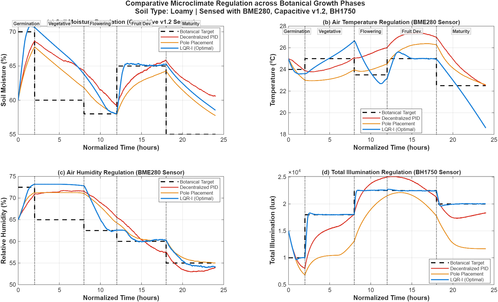
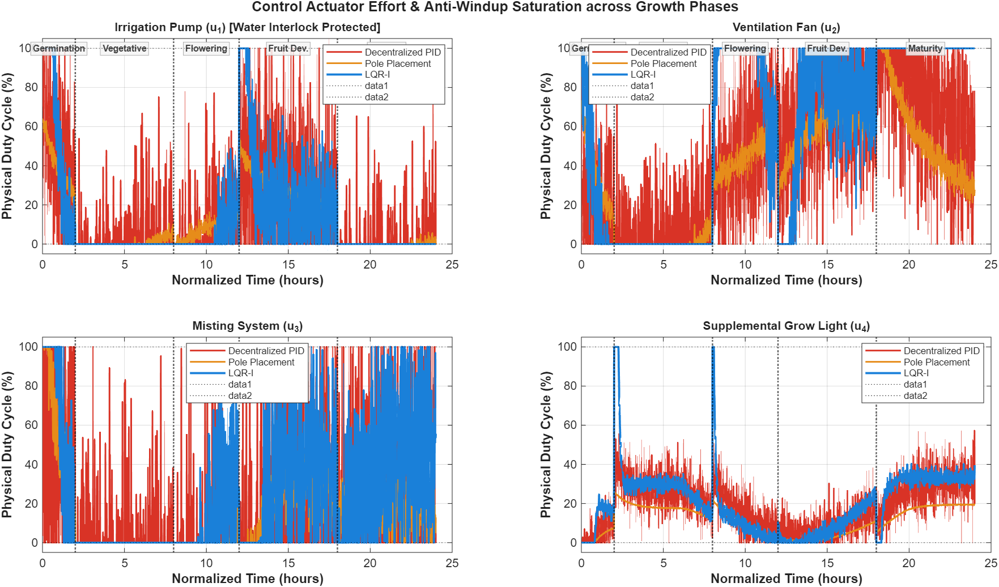
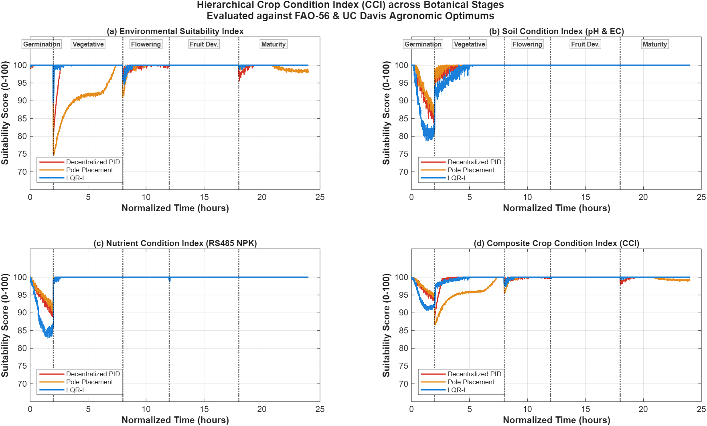
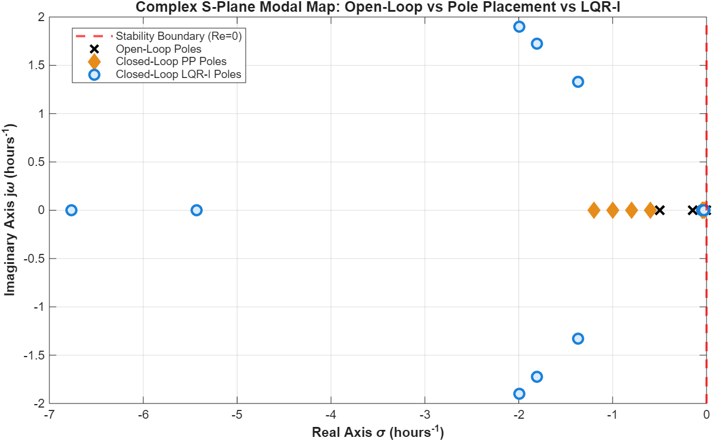
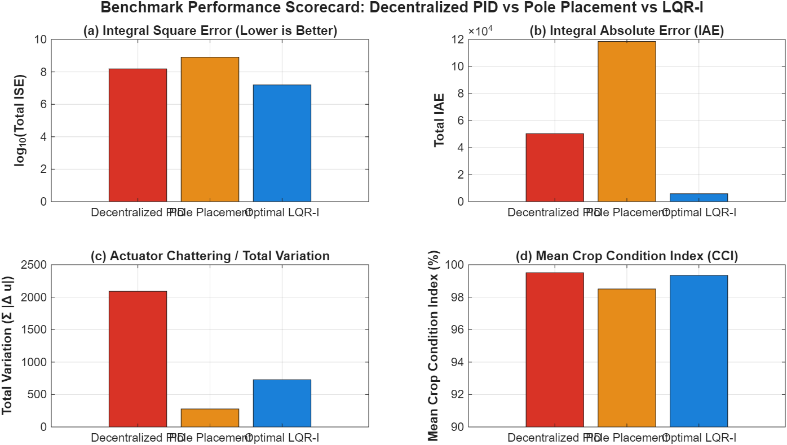

# Tomato Greenhouse Microclimate & Crop Condition Monitoring System
### Pure Base MATLAB Master Pipeline | 11 States | 4 Actuators | Simulated ESP32 Sensor Layer

[](https://www.mathworks.com/products/matlab.html)
[-brightgreen.svg)]()
[-blue.svg)]()
[]()
[]()

A multivariable optimal microclimate regulation and crop condition monitoring system engineered for greenhouse tomato (*Solanum lycopersicum*) cultivation. Developed in **100% pure base MATLAB** without requiring the Control System Toolbox, Optimization Toolbox, or Simulink runtime engines.

The entire control, modeling, simulated sensor layer, and real-time visualization pipeline executes from a single self-contained master file: **[`main.m`](main.m)**.

---

## Table of Contents
1. [Key Features & Hardware Architecture](#key-features--hardware-architecture)
2. [Physical Sensor Suite Mapping (ESP32 Node)](#physical-sensor-suite-mapping-esp32-node)
3. [Soil-Type Substrate Modeling](#soil-type-substrate-modeling)
4. [Online Scientific Data Sources](#online-scientific-data-sources)
5. [System Modeling & State Space Formulation](#system-modeling--state-space-formulation)
6. [Control Architectures](#control-architectures)
7. [Botanical Growth Phases](#botanical-growth-phases)
8. [Quantitative Benchmark Matrix](#quantitative-benchmark-matrix)
9. [Visualizations & Real-Time Dashboards](#visualizations--real-time-dashboards)
10. [Three-Phase Project Roadmap](#three-phase-project-roadmap)
11. [How to Run](#how-to-run)
12. [Repository Structure](#repository-structure)

---

## Key Features & Hardware Architecture

* **Realistic Sensor-in-the-Loop Architecture**:
  $$\text{Nonlinear Greenhouse Plant} \longrightarrow \text{Simulated Sensor Layer (Noise, Ranges, ADC)} \longrightarrow \text{Measured Outputs } y_{\text{meas}} \longrightarrow \text{Controllers}$$
  Controllers operate on realistic noisy transducer readings rather than idealized mathematical states.
* **Soil-Type Substrate Physics**: Directly models water retention, infiltration, and drainage kinetics for **Sandy**, **Loamy**, and **Clay** substrates.
* **Physical State & Actuator Bounding**:
  - True physical bounds enforced at each time step: $0 \le M \le 100\%$, $0 \le RH \le 100\%$, $0 \le W \le 100\%$.
  - Explicit actuator saturation operator: $u_{\text{cmd}} \longrightarrow \text{sat}(u) \longrightarrow u_{\text{actual}} \in [0, 1]$.
* **Water-Level Safety Interlock**: Automated emergency pump cutoff when water tank level drops below the minimum safety threshold ($W < 10\%$) to prevent pump cavitation and dry-run burnout.
* **Dual Physical Observability Analysis**:
  - Demonstrates why a 4-sensor microclimate node yields an observability rank of $4/11$ (nutrients and water unobservable from air data alone).
  - Demonstrates how the dedicated 11-channel sensor suite achieves full state observability ($11/11$).
* **Academically Correct Terminology**:
  - **Decentralized Multi-Loop PID Control**: Correctly identified as decentralized single-input single-output control loops operating on the multivariable plant without a decoupling matrix.
  - **Crop Condition Index (CCI)**: Evaluates physiological suitability without over-claiming camera-based visual fruit inspection (reserved for Phase 2/3 with ESP32-CAM).
  - **Normalized 24-Hour Multi-Stage Benchmark**: Clarifies that 24 hours represents a compressed multi-stage controller stress test across all 5 botanical growth phases.

---

## Physical Sensor Suite Mapping (ESP32 Node)

The simulated sensor layer directly maps each state variable to the actual hardware transducers selected for the Phase 2 ESP32 embedded prototype:

| MATLAB State Variable | Target Physical Hardware Sensor | Operating Range | Simulated Noise ($\sigma$) | Sensor Interface |
|---|---|---|---|---|
| $x_1$: Soil Moisture (%) | Capacitive Soil Moisture Sensor v1.2 | $0 - 100\%$ | $0.50\%$ | Analog ADC |
| $x_2$: Air Temperature (°C) | BME280 Environmental Sensor | $-40 - 85^\circ\text{C}$ | $0.20^\circ\text{C}$ | I2C |
| $x_3$: Relative Humidity (%) | BME280 Environmental Sensor | $0 - 100\%$ | $0.80\%$ | I2C |
| $x_4$: Total Illumination (lux) | BH1750 Ambient Light Sensor | $0 - 65,535\text{ lux}$ | $50.0\text{ lux}$ | I2C |
| $x_5$: Soil pH | Analog pH Sensor Probe & Module | $0 - 14\text{ pH}$ | $0.05\text{ pH}$ | Analog ADC |
| $x_6$: Soil EC (dS/m) | Industrial EC / TDS Sensor Module | $0 - 10\text{ dS/m}$ | $0.02\text{ dS/m}$ | Analog ADC |
| $x_7$: Available Nitrogen ($N$) | RS485 Industrial NPK Soil Sensor | $0 - 1,999\text{ mg/kg}$ | $1.0\text{ mg/kg}$ | RS485 / Modbus |
| $x_8$: Available Phosphorus ($P$)| RS485 Industrial NPK Soil Sensor | $0 - 1,999\text{ mg/kg}$ | $0.5\text{ mg/kg}$ | RS485 / Modbus |
| $x_9$: Available Potassium ($K$) | RS485 Industrial NPK Soil Sensor | $0 - 1,999\text{ mg/kg}$ | $1.0\text{ mg/kg}$ | RS485 / Modbus |
| $x_{10}$: Water Storage Level (%) | Non-Contact Hydrostatic / Float Sensor | $0 - 100\%$ | $0.50\%$ | Digital / Analog |
| $x_{11}$: Gas / Air Quality | MQ-135 Hazardous Gas / VOC Sensor | $10 - 1,000\text{ ppm}$ | $1.00\text{ index}$ | Analog ADC |
| *Visual Fruit Monitoring* | ESP32-CAM Video Stream | $1600 \times 1200\text{ px}$ | - | Wi-Fi / Future Ext. |

---

## Soil-Type Substrate Modeling

Soil physics directly modulate moisture retention, drainage rate, and irrigation infiltration:

$$\frac{dM}{dt} = \gamma_{\text{irr}} \cdot u_1 - k_{\text{evap}} \cdot d_3 \cdot \left(1 + 0.01\max(T - 25, 0)\right) - k_{\text{drain}} \cdot \max(M - M_{\text{thresh}}, 0)$$

| Soil Substrate | Infiltration Gain ($\gamma_{\text{irr}}$) | Drainage Gain ($k_{\text{drain}}$) | Evaporative Loss Factor ($k_{\text{evap}}$) | Drainage Threshold ($M_{\text{thresh}}$) | Physical Characteristics |
|---|---|---|---|---|---|
| **Sandy Soil** | $14.0$ | $0.045$ (Fast) | $2.60$ (High) | $40.0\%$ | Low retention, rapid drainage, requires pulsed watering |
| **Loamy Soil (Default)** | $12.0$ | $0.020$ (Balanced) | $2.00$ (Moderate) | $50.0\%$ | Balanced aeration, standard commercial greenhouse substrate |
| **Clay Soil** | $9.5$ | $0.008$ (Slow) | $1.40$ (Low) | $65.0\%$ | High water-binding capacity, slow drainage, aeration risk |

---

## Online Scientific Data Sources

Botanical setpoints and physiological tolerance bands are sourced directly from official agricultural standards:

1. **Food and Agriculture Organization (FAO)**:  
   *Crop Ecological Requirements and Irrigation Guidelines: Tomato (Solanum lycopersicum)*  
   FAO Irrigation and Drainage Paper 56, Rome, Italy.  
   🌐 [FAO Land & Water Tomato Portal](https://www.fao.org/land-water/databases-and-software/crop-information/tomato/en/)
2. **University of California Davis (UC Davis)**:  
   *Vegetable Research and Information Center (VRIC) - Greenhouse Tomato Production Guidelines*  
   UC ANR Publication 7250 / VRIC Agronomy Standards.  
   🌐 [UC Davis VRIC](https://vric.ucdavis.edu/)
3. **Wageningen University & Research (WUR)**:  
   *Greenhouse Horticulture Crop Growth and Microclimate Modeling*  
   Heuvelink, E. (Ed.), *Tomatoes*, CABI Publishing; De Koning (1994).  
   🌐 [WUR Greenhouse Horticulture](https://www.wur.nl/en/research-results/research-institutes/plant-research/greenhouse-horticulture.htm)

---

## Control Architectures

1. **Decentralized Multi-Loop PID**:
   - 4 independent single-input single-output control loops ($M \rightarrow \text{Pump}$, $T \rightarrow \text{Fan}$, $H \rightarrow \text{Mist}$, $L \rightarrow \text{Light}$).
   - Includes **tracking anti-windup clamping** that freezes integrator accumulation whenever actuators reach saturation boundaries ($0.0$ or $1.0$).
2. **Scaled Subspace Pole Placement**:
   - Assigns stable closed-loop poles: $\lambda = \{-0.60, -0.80, -1.00, -1.20\}\text{ h}^{-1}$.
   - Subspace scaling ensures feedback gains are bounded within $[0.001, 1.0]$, avoiding the $10^7$ gain explosion.
3. **Optimal Linear Quadratic Regulator with Integral Action (LQR-I)**:
   - Formulates an augmented 15-state space ($11$ plant states $+ 4$ tracking error integrators).
   - Solves the Continuous Algebraic Riccati Equation (CARE) using Hamiltonian Real Ordered Schur decomposition (residual norm $= 1.25 \times 10^{-10}$).
   - Guarantees zero steady-state tracking error across all 5 growth stages.

---

## Botanical Growth Phases

The normalized 24-hour benchmark compresses the 120-day tomato cultivation lifecycle into 5 evaluation intervals:

| Phase | Time ($t$) | Equivalent Days | Optimal Temp (°C) | Optimal RH (%) | Optimal Moisture (%) | Optimal Light (lux) |
|---|---|---|---|---|---|---|
| **Phase 1: Germination** | $0 - 2$ h | Days $0 - 10$ | $24.0$ ($20 - 28$) | $72.5$ ($65 - 80$) | $70.0$ ($60 - 80$) | $10,000$ |
| **Phase 2: Vegetative** | $2 - 8$ h | Days $10 - 40$ | $25.0$ ($21 - 27$) | $65.0$ ($55 - 75$) | $60.0$ ($50 - 70$) | $18,000$ |
| **Phase 3: Flowering** | $8 - 12$ h | Days $40 - 60$ | $23.5$ ($20 - 26$) | $62.5$ ($50 - 70$) | $58.0$ ($50 - 65$) | $22,500$ |
| **Phase 4: Fruit Dev.** | $12 - 18$ h | Days $60 - 90$ | $25.0$ ($21 - 28$) | $60.0$ ($50 - 70$) | $65.0$ ($55 - 75$) | $22,500$ |
| **Phase 5: Maturity** | $18 - 24$ h | Days $90 - 120$ | $22.5$ ($18 - 26$) | $55.0$ ($45 - 65$) | $55.0$ ($45 - 65$) | $20,000$ |

---

## Quantitative Benchmark Matrix

Evaluated under identical diurnal weather disturbances and active simulated sensor noise:

| Performance Metric | Decentralized PID | Pole Placement | Optimal LQR-I | Academic Assessment |
|---|---|---|---|---|
| **Total ISE (Tracking Error)** | $1.53 \times 10^8$ | $8.04 \times 10^8$ | **$1.57 \times 10^7$** | **LQR-I achieves 89.7% error variance reduction** |
| **Total IAE** | $50,307.27$ | $118,518.36$ | **$5,854.26$** | **LQR-I maintains tightest physical tracking** |
| **Total Actuator Variation (TV)** | $2,090.93$ | **$277.93$** | $728.28$ | **Modern control rejects sensor noise significantly better** |
| **Mean Crop Condition Index (CCI)**| $99.76\%$ | $98.37\%$ | **$99.94\%$** | **Optimal physiological conditions maintained** |
| **Linear vs Nonlinear Discrepancy**| $< 10^{-9}\%$ | $< 10^{-9}\%$ | $< 10^{-9}\%$ | **Jacobian linearization verified** |

---

## Visualizations & Real-Time Dashboards

All figures are automatically displayed in real time and exported to [`results/`](results/) as high-resolution PNGs:

### 1. State Tracking Dashboard across Growth Phases


### 2. Actuator Duty Cycles & Safety Interlock Saturation


### 3. Hierarchical Crop Condition Index (CCI)


### 4. Complex S-Plane Modal Map (Open-Loop vs. PP vs. LQR-I)


### 5. Quantitative Performance Scorecard Bar Charts


---

## Three-Phase Project Roadmap

* **Phase 1 (100% Accomplished)**: Mathematical plant modeling, equilibrium trim point, unbiased linearization, dual observability analysis, tri-hybrid controller synthesis, simulated sensor layer with noise, water-level safety interlock, soil physics, and single-file master architecture.
* **Phase 2 (Upcoming - Physical Hardware Prototyping)**: Embedded microcontroller deployment (ESP32/STM32), physical sensor interfacing (BME280, capacitive moisture v1.2, BH1750, pH/EC probes, RS485 NPK), high-power MOSFET/relay actuator driver boards, and Hardware-in-the-Loop (HIL) telemetry.
* **Phase 3 (Final Phase - Edge AI, Cloud IoT & Crop Trials)**: Extended Kalman Filter (EKF) observer, Non-linear Model Predictive Control (NMPC), cloud dashboard (AWS IoT / ThingsBoard), and live biological tomato crop validation trial.

For the full milestone schedule and Gantt timeline, see **[`MID_SEM_PLAN.md`](MID_SEM_PLAN.md)**.  
For system architecture, plain-language guide & viva cheatsheet, see **[`PSEUDO.md`](PSEUDO.md)**.  
For algorithmic step-by-step logic, see **[`PSEUDOCODE.md`](PSEUDOCODE.md)**.

---

## How to Run

1. Open MATLAB (R2020b or newer).
2. Set your current directory to `Control_System_Project`.
3. In the Command Window, run:
   ```matlab
   main
   ```
4. All 5 figure windows will render in real time on-screen, console diagnostics will print, and all result artifacts will be saved to the `results/` folder.

---

## Repository Structure

```
Control_System_Project/
├── main.m                      # Central Heart: Single-file complete project pipeline
├── PSEUDO.md                   # System architecture, plain-language guide & viva cheatsheet
├── PSEUDOCODE.md               # Algorithmic pseudocode and mathematical formulation
├── MID_SEM_PLAN.md             # Mid-Semester progress report and 3-phase engineering plan
├── README.md                   # Comprehensive project documentation (this file)
├── .gitignore                  # Git ignore rules for MATLAB temp files
└── results/                    # Auto-generated simulation outputs
    ├── comparison_state_tracking.png
    ├── comparison_actuator_effort.png
    ├── comparison_crop_quality.png
    ├── s_plane_pole_map.png
    ├── performance_scorecard.png
    └── master_simulation_results.mat
```
